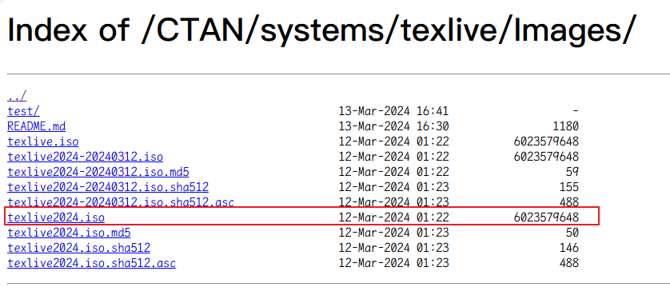
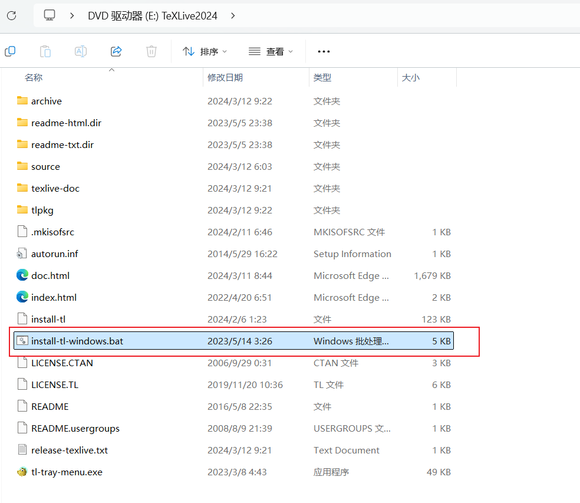
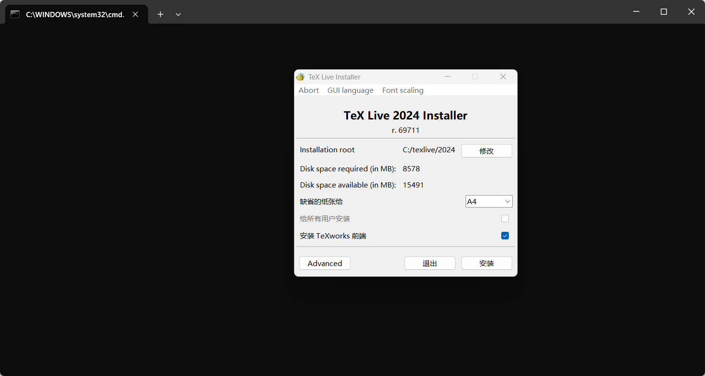
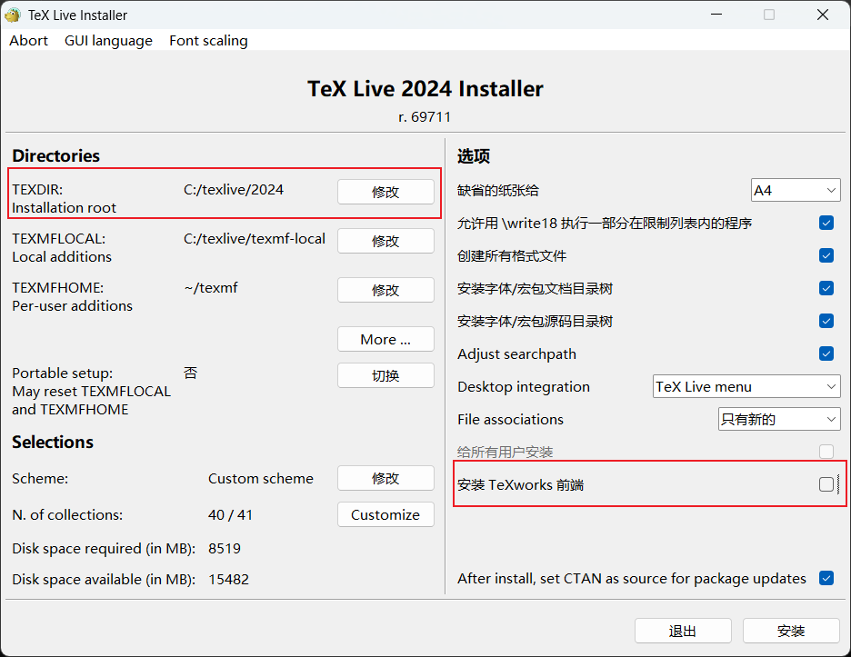
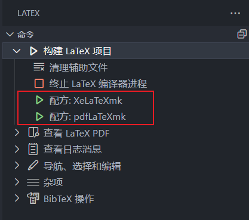

+++
title = 'TeXLive+ VSCode 安装与环境配置'
date = 2025-01-05T13:36:19+08:00
draft = false
description = '配置TeXLive+ VSCode安装与配置过程'
slug = 'texlive'
tags = ['LaTex','环境配置']
categories = ['弄斧']
image = ''
license = false
+++

记录和介绍一下TeXLive + VSCode 安装与环境配置过程（Windows）

## TeXLive安装

### 概念区分

虽然已经使用LaTex写了许多实验报告和论文，但是对于这个大家族的许多概念名词有很多的混淆。所以先做一下概念区分（来源于GPT）

**TeX**

TeX 是一种由 Donald Knuth 开发的**排版语言**，专门用于高质量的文字排版，尤其是数学公式和复杂文档。而Tex语言的文件后缀以.tex结尾，也是我们使用LaTex时文件的通用后缀。

**LaTeX**

LaTeX 是基于 TeX 的宏包（或称为扩展），由 Leslie Lamport 开发，旨在简化 TeX 的使用。可以理解成扩展后的TeX，其底层仍然是TeX语言，并且文件仍然以.tex结尾。

**TeX引擎**

TeX 引擎是实际执行 TeX 语言代码的程序，负责将 TeX 文件编译为输出文件（如 PDF、DVI）。

常见的TeX引擎有：

+ `pdfTeX`
+ `XeTeX`
+ `LuaTeX`

**TeX编译器**

TeX 编译器是指用于调用 TeX 引擎并编译 TeX 文件的工具或命令。

常见 TeX 编译器：

+ `pdflatex`：
   - 使用 pdfTeX 引擎，将 .tex 文件直接编译为 PDF。
+ `xelatex`：
   - 使用 XeTeX 引擎，支持 Unicode 和系统字体。
+ `lualatex`：
   - 使用 LuaTeX 引擎，支持 Lua 脚本和现代字体。
+ `latex`：
   - 使用传统 TeX 引擎，生成 DVI 文件。
+ `bibtex` 和 `biber`：
   - 用于处理参考文献。

### TeXLive

**TeX Live** 是一个跨平台的、全面的 TeX 发行版，它包含了 TeX 文档排版系统所需的所有核心工具、宏包、字体和文档。

如：

+ **TeX 引擎**：
   - 包括 `pdfTeX`、`XeTeX`、`LuaTeX` 等，用于将 TeX 文件编译为 PDF 或其他格式。
+ **LaTeX**：
   - LaTeX 是基于 TeX 的宏包，用于简化复杂文档的排版。TeX Live 包含了 LaTeX 的核心宏包和工具。
+ **宏包和工具**：
   - TeX Live 包含了数千个宏包（如 `graphicx`、`amsmath`、`hyperref` 等），用于扩展 TeX 和 LaTeX 的功能。
   - 还包含了许多工具，如 `BibTeX`（参考文献管理）、`MakeIndex`（索引生成）等。
+ **字体**：
   - TeX Live 提供了大量字体支持，包括标准字体（如 Computer Modern）和扩展字体（如 OpenType 字体）。
+ **文档和示例**：
   - TeX Live 包含了丰富的文档和示例文件，帮助用户学习和使用 TeX 和 LaTeX。

## TeXLive下载与安装

### 下载

TeXLive虽然官网有下载，但是推荐在镜像站下载。这里推荐

+ [清华大学TeXLive镜像](https://mirrors.tuna.tsinghua.edu.cn/CTAN/systems/texlive/Images/)

+ [浙江大学TeXLive镜像](https://mirrors.zju.edu.cn/CTAN/systems/texlive/Images/)

这里直接下载textlive2024.iso镜像即可



### 安装

下载完成后，双击打开或者右键-选择`装载`，然后能在资源管理器看到装载好的DVD驱动器（一般情况下会自动打开）

打开`install-tl-windows.bat`脚本文件，即可开始安装



打开后会自动打开一个cmd窗口，并跳出一个安装ui界面如下



这里可以点击`Advanced`，看见更详细的安装配置，这里推荐修改两个地方

+ 修改TEXDIR，即安装位置
+ 取消勾选“安装TeXworks前端”（因为我们使用vscode作为编辑器，所以不再需要TeXworks）



然后点击安装。安装过程因人（电脑）而异，大概需要一个小时左右。

#### 测试是否安装成功

安装完成后，可以打开命令行或PowerShell，输入

```bash
latex -v
```

如果出现以下输出，即说明安装成功

```bash
PS C:\Users\XXX> latex -v
pdfTeX 3.141592653-2.6-1.40.26 (TeX Live 2024)
kpathsea version 6.4.0
Copyright 2024 Han The Thanh (pdfTeX) et al.
There is NO warranty.  Redistribution of this software is
covered by the terms of both the pdfTeX copyright and
the Lesser GNU General Public License.
For more information about these matters, see the file
named COPYING and the pdfTeX source.
Primary author of pdfTeX: Han The Thanh (pdfTeX) et al.
Compiled with libpng 1.6.43; using libpng 1.6.43
Compiled with zlib 1.3.1; using zlib 1.3.1
Compiled with xpdf version 4.04
PS C:\Users\XXX>
```

如果提示无法识别，可能是因为环境变量没有配置好（课自行百度TeXLive配置环境变量）

## VSCode配置

### 安装LaTex Workshop插件


### 配置`settings.json`文件

#### LaTex编译工具链配置

**LaTeX 编译工具链** 是指用于将 `.tex` 源文件编译为最终输出文件（如 PDF）的一系列工具和步骤。要配置编译工具链，需要配置**工具（Tools）**和**配方（Recipes）**两个部分。

###### **Tools（工具）**

`Tools` 是单个编译命令，例如：

- `pdflatex`：用于编译 `.tex` 文件。
- `bibtex`：用于处理参考文献。
- `biber`：用于处理 `biblatex` 的参考文献。
- `makeindex`：用于生成索引。

每个工具都有一个 `name`、`command` 和 `args`（参数）。

**Recipes（配方）**

`Recipes` 是一组工具的集合，定义了完整的编译流程。例如：

- 一个典型的 LaTeX 编译配方可能包括：
  1. 运行 `pdflatex` 生成 `.aux` 文件。
  2. 运行 `bibtex` 处理参考文献。
  3. 再次运行 `pdflatex` 更新引用。
  4. 最后运行 `pdflatex` 生成最终的 PDF。

这里我们使用`latexmk`

`latexmk` 是一个非常强大的工具，可以自动处理 LaTeX 文档的多步编译（包括 `pdflatex`、`bibtex`、`biber` 等），非常适合复杂的文档。

在配置文件中，配置了两个`latexmk`的工具，分别基于xeLaTex和pdfLaTex

```js
{
    "latex-workshop.latex.tools": [
        {
            "name": "XeLaTeXmk",
            "command": "latexmk",
            "args": [
              "-xelatex",
              "-synctex=1",
              "-shell-escape",
              "-interaction=nonstopmode",
              "-file-line-error",
              "%DOC%"
            ]
        },    
        {
            "name": "pdfLaTeXmk",
            "command": "latexmk",
            "args": [
              "-pdflatex",
              "-synctex=1",
              "-shell-escape",
              "-interaction=nonstopmode",
              "-file-line-error",
              "%DOC%"
            ]
        },
    ],
}
```
然后配置两个配方
```js
{ 
	// Latex编译工具链
    "latex-workshop.latex.recipes": [
        {
            "name": "XeLaTeXmk",
            "tools": ["XeLaTeXmk"]
        },
        {
            "name": "pdfLaTeXmk",
            "tools": ["pdfLaTeXmk"]
        },
    ],
}
```

配置好后，可以在LaTeX Workshop 插件中看到配置。使用时点击对应配方即可编译。LaTeX Workshop 默认会使用配置文件中定义的第一个配方进行编译。



#### 其他配置

```js
{
    // Latex其他配置
    "latex-workshop.view.pdf.viewer": "tab", // pdf预览方式
    "latex-workshop.message.error.show": false, // 是否显示错误信息
    "latex-workshop.message.warning.show": false, // 是否显示警告信息
    "latex-workshop.latex.autoClean.run": "onBuilt",
    // 清理时删除的文件类型
    "latex-workshop.latex.clean.fileTypes": [
        "*.aux",
        "*.bbl",
        "*.blg",
        "*.idx",
        "*.ind",
        "*.lof",
        "*.lot",
        "*.out",
        "*.toc",
        "*.acn",
        "*.acr",
        "*.alg",
        "*.glg",
        "*.glo",
        "*.gls",
        "*.ist",
        "*.fls",
        "*.log",
        "*.fdb_latexmk"
    ],
    //从使用的包中自动补全命令和环境
    "latex-workshop.intellisense.package.enabled": true,
    //设置vscode编译tex文档时的默认编译链为上次使用
    "latex-workshop.latex.recipe.default": "lastUsed",
    "latex-workshop.latex.autoBuild.run": "never",
}
```

有注释，不做过多解释。
