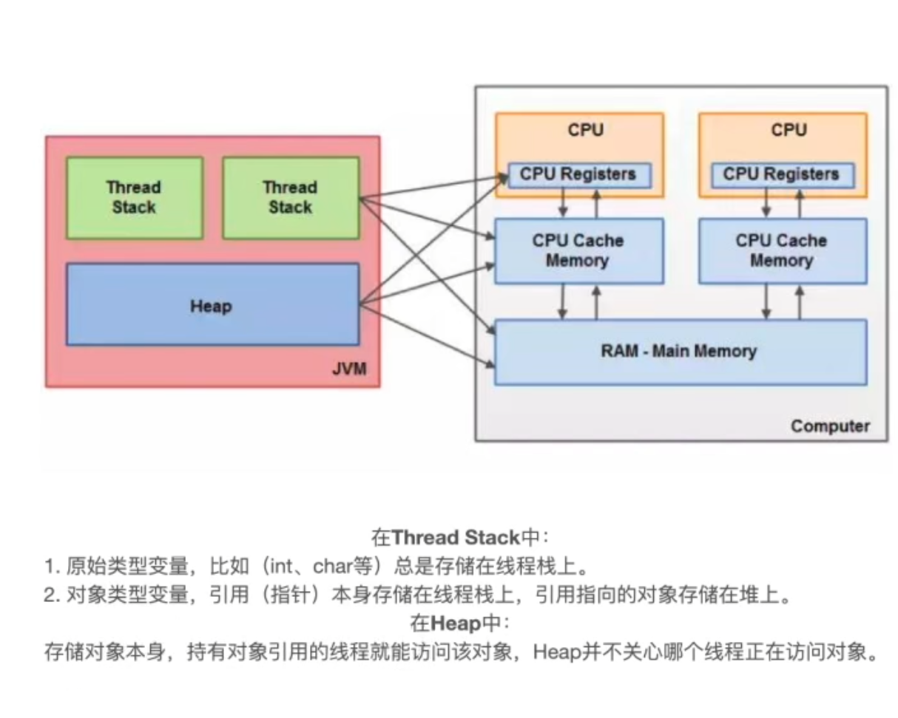
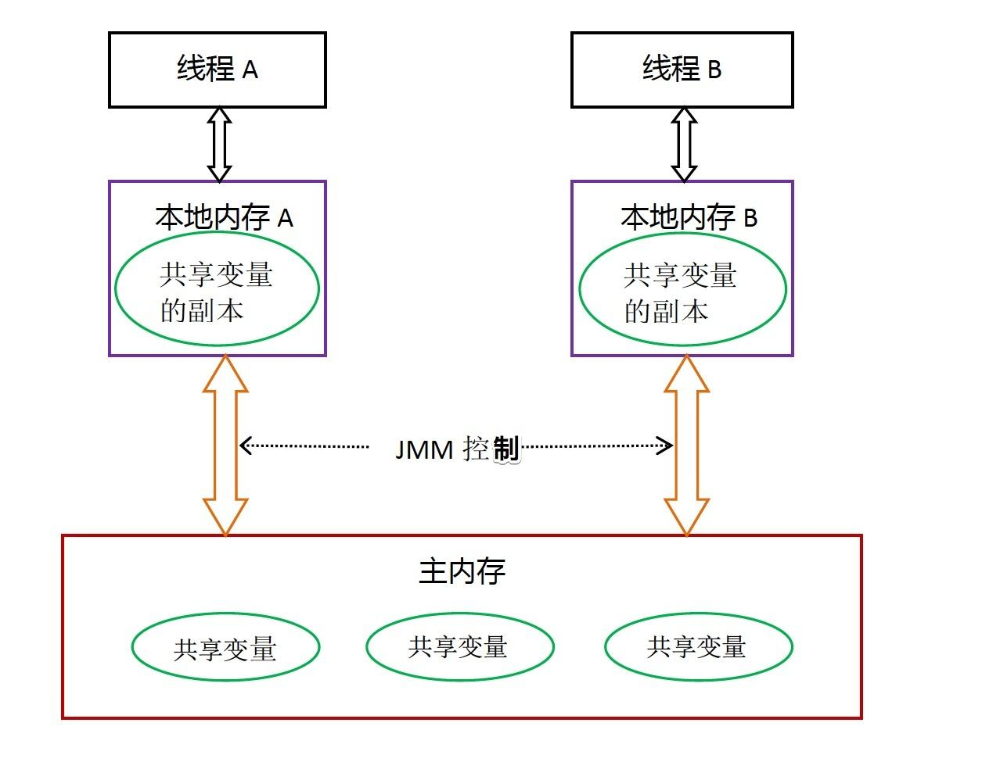

+++
title = 'Java内存模型(JMM) - 一篇不太详细的解释'
date = 2025-02-22T21:09:30+08:00
draft = false
description = '学习Java内存模型(JMM)的总结，包括运行时数据区、顺序一致性模型、happens-before原则、volatile关键字、锁机制、synchronized关键字'
slug = 'jmm'
tags = ['JAVA并发']
categories = ['技术']
image = ''
license = false
+++

## Java内存模型(JMM)

### 运行时数据区


**线程私有：**

+ 本地方法栈：用于管理本地方法的调用，里面并没有我们写的代码逻辑，其由native修饰，由 C 语言实现。 

+ 程序计数器：它是一块很小的内存空间，主要用来记录各个线程执行的字节码的地址，例如，分支、循环、线程恢复等都依赖于计数器。 

+ **Java虚拟机栈**：用于存储局部变量表、操作数栈、动态链接、方法出口等信息。（栈里面存的是地址，实际指向的是堆里面的对象） 
  + 方法运行时的局部变量和操作数存储在 Java 虚拟机栈（JVM Stack）中，例如在方法穿进来的参数变量、方法中创建的变量、方法中创建的对象（存其指向堆对象的地址）。

**线程共有：**

+ **堆**：Java 虚拟机中内存最大的一块，是被所有线程共享的，几乎所有的对象实例都在这里分配内存；
  + 如创建对象时会在堆开辟空间存放对象，并将在虚拟机栈中存放该对象地址
  + 如常量池在堆中开辟

+ 方法区（Java8叫元空间）：用于存放已被虚拟机加载的类信息，常量，静态变量等数据。 
  + 方法区存储的是与类相关的元数据信息，包括类的结构（如类名、父类名、修饰符等）、字段信息、方法信息、运行时常量池等。
  + 如类的信息（有哪些字段、方法等等）

### Java内存模型

如果要讲Java内存模型，需要先了解硬件内存模型，因为Java内存模型实际上是一种对硬件内存模型的“重新抽象与封装”



理解：

+ 线程一般来说对存在Stack的数据访问更频繁，所以Stack的数据大部分应该是在CPU寄存器、缓存中储存
+ 而Heap中的数据访问不那么频繁，所以Heap中的数据更可能在内存中存储

在硬件模型中，CPU1会将数据D从主内存放到Cache1中，假设叫D1，并对D1进行修改，CPU2从主内存中将D取到Cache2中，假设叫D2，进行修改。如果CPU1修改D1后并没有即时更新D1到主内存的D中，那么CPU2就不会获得最新的D，便产生了数据不同步问题。针对这个问题，便有了缓存一致性协议。

在Java内存模型中，可以抽象为以下模型。



线程之间的共享变量存储在主内存（main memory）中，每个线程都有一个私有的本地内存（local memory），本地内存中存储了该线程以读 / 写共享变量的副本。

1. 所有的共享变量都存在主内存中。 
2. 每个线程都保存了一份该线程使用到的共享变量的副本。 
3. 如果线程A与线程B之间要通信的话，必须经历下面2个步骤： 
   1. 线程A将本地内存A中更新过的共享变量刷新到主内存中去。
   2. 线程B到主内存中去读取线程A之前已经更新过的共享变量。

而JMM规定，**线程对共享变量的所有操作都必须在自己的本地内存中进行，不能直接从主内存中读取**。即线程B需要先读取其本地内存变量，如果发现这个变量和主内存的变量不一致，才会去更新本地内存的变量，再读取本地内存的变量，**而不是直接去读取主内存的变量**。

而如何解决共享变量一致性问题，便是JMM的功能。

即线程如何直到本地内存的变量已经被其他线程更新？即内存是否对其他线程可见？

JMM出手：**JMM通过控制主内存与每个线程的本地内存之间的交互，来提供内存可见性保证**。

Java中的volatile关键字可以保证多线程操作共享变量的可见性以及禁止指令重排序，synchronized关键字不仅保证可见性，同时也保证了原子性（互斥性）。

#### 顺序一致性模型 与 Java 内存模型（JMM）

##### 顺序一致性模型

这里讲的顺序一致性模型是一种**理论参考模型**

顺序一致性模型有两大特性：

- 一个线程中的所有操作必须按照程序的顺序（即Java代码的顺序）来执行。
- 不管程序是否同步，所有线程都只能看到一个单一的操作执行顺序。即在顺序一致性模型中，每个操作必须是**原子性的，且立刻对所有线程可见**。

也就是如果线程A有A1,A2,A3三个操作，B有B1,B2,B3三个操作，如果在顺序一致性下，无论是否同步，线程各自的执行顺序都严格保证A1-A2-A3，B1-B2-B3，并且两个线程的各自的三个**操作都对任意线程可见**。

思考是否有缺点：

+ 如果所有顺序都**严格按照顺序串行执行**，那么像处理器流水线机制是否无法发挥提高效率作用？
+ 如果所有线程自己的操作都**对所有线程可见**，即每次写操作都立即刷新到主内存，这是否增大了性能开销？

##### Java 内存模型（JMM）

考虑到顺序一致性模型的两个缺点，JMM内存模型并没有严格按照顺序一致性模型，而是有一些区别。

**如果是未同步情况：**

+ 顺序一致性保证单线程内的操作会按程序的顺序执行；JMM不保证单线程内的操作会按程序的顺序执行。（因为重排序，但是JMM保证单线程下的重排序不影响执行结果） 
+ 顺序一致性模型保证所有线程只能看到一致的操作执行顺序，而JMM不保证所有线程能看到一致的操作执行顺序。（因为JMM不保证所有操作立即可见）

**如果是同步情况：**

我们将同步块或者同步方法包含的代码区域成为临界区（被 `synchronized` 关键字修饰)。

+ 临界区内的代码，JMM允许重排序以提高性能，只要不改变程序结果
+ 但是不能将临界区内的写操作重排序到临界区外

同时，当线程进入或者退出临界区时，会进行特殊处理，使得在临界区内程序获得与顺序一致性模型相同的内存视图。

- **进入临界区**：当一个线程进入临界区时，JMM会确保该线程能看到所有之前对共享变量的修改。这通常通过刷新线程的本地缓存（从主内存中读取最新的值）来实现。
- **退出临界区**：当一个线程退出临界区时，JMM会确保该线程对共享变量的修改对其他线程可见。这通常通过将线程的本地缓存写回主内存来实现。

**即在临界区内，线程看到的所有共享变量的值都是最新的**

##### JMM对64位变量（long和double）的原子性处理

JMM不保证对64位的long型和double型变量的写操作具有原子性，而顺序一致性模型保证对所有的内存读写操作都具有原子性。

- **非原子性**：在JMM中，对64位的`long`和`double`类型变量的写操作**不保证原子性**。这意味着，如果一个线程正在写入一个`long`或`double`变量，另一个线程可能会看到该变量的**部分写入值**（即只看到高32位或低32位）。
- **原因**：这种设计主要是为了在某些硬件平台上提高性能。一些32位平台可能无法以原子方式处理64位数据，因此JMM选择不强制要求对`long`和`double`的写操作具有原子性。

即，假设我们有一个`long`变量，其值为`0x123456789ABCDEF0`（64位）：

- **第一步**：写入低32位（`0x9ABCDEF0`）。
- **第二步**：写入高32位（`0x12345678`）。

如果在这个过程中没有同步机制（如`volatile`或`synchronized`），另一个线程可能会看到中间状态，例如只看到低32位被写入，而高32位仍然是旧值。

#### 最小安全性

最小安全性是指，在多线程环境中，即使没有显式的同步机制，程序的行为也不会完全失控。具体来说：

- 线程读取到的值必须是之前某个线程写入的值，或者是默认值（如`0`、`false`、`null`等）。
- 线程不会凭空（Out-of-Thin-Air）读取到一个完全不合理或未定义的值。

**线程读取到的值，要么是之前某个线程写入的值，要么是默认值，不会无中生有。**

为了实现这个安全性，JVM在堆上分配对象时，首先会对内存**空间清零**，然后才会在上面分配对象（这两个操作是同步的）。

> 空间清零
>
> Memory Zeroing: 实际上翻译有所误解，Zeroing指设置默认值为0或其他默认值，并非清零

#### happens-before原则

为了解放程序员，让程序员在开发时尽量不用考虑内存可见和指令重排问题，JMM提供了happens-before原则，只要程序员按照这个原则写代码，则程序就能保证在JMM中具有强的内存可见性。

happens-before关系的定义如下： 

1. 如果一个操作happens-before另一个操作，那么第一个操作的执行结果将对第二个操作可见，而且第一个操作的执行顺序排在第二个操作之前。 
2. **两个操作之间存在happens-before关系，并不意味着Java平台的具体实现必须要按照happens-before关系指定的顺序来执行。如果重排序之后的执行结果，与按happens-before关系来执行的结果一致，那么JMM也允许这样的重排序。**

举例

```java
class Example {
    boolean flag = false;
    int x = 0;

    void writer() {
        x = 42;
        flag = true;
    }

    void reader() {
        if (flag) {
            System.out.println(x);
        }
    }
}
```

如果多线程情景下，线程1执行writer()方法，线程2执行reader()方法，并没有考虑happens-before原则，会出现以下可能问题

- 内存可见性问题：在多线程环境中，每个线程可能会在自己的本地缓存中操作变量，而不是直接从主内存中读取或写入。
- 结果
  - `writer`线程对`x`和`flag`的修改可能不会立即刷新到主内存。
  - `reader`线程可能读取到`flag`和`x`的过期值。

- 指令重排序问题：编译器和处理器可能会对指令进行重排序以优化性能。
- 结果
  - `writer`方法中的`x = 42`和`flag = true`可能会被重排序，导致`flag = true`先执行，而`x = 42`后执行。
  - `reader`线程可能看到`flag`为`true`，但`x`的值仍然是`0`。

要实现happens-before原则，可以

+ 将`flag`声明为`volatile`，可以确保`writer`线程对`flag`的修改对`reader`线程可见，并且禁止指令重排序。
+ 通过`synchronized`块保护`writer`和`reader`方法，可以确保内存可见性和原子性。
+ 通过`Lock`显式控制临界区，可以确保内存可见性和原子性。

#### 内存屏障

内存屏障是实现happens-before关系的技术手段，而happens-before是内存屏障在JMM中的高层抽象。

内存屏障是JMM实现happens-before原则的机制。上文提到的通过`volatile`或通过`synchronized`块等方法便是使用了内存屏障机制。

后文会详解`volatile`关键字。

#### volatitle关键字

在Java中，volatile关键字有特殊的内存语义。volatile主要有以下两个功能：

- 保证变量的**内存可见性**（即当该变量被某个线程修改之后，另一个线程可以正确获取修改后的值）
- 禁止volatile变量与普通变量**重排序**（JSR133提出，Java 5 开始才有这个“增强的volatile内存语义”）

##### 具体机制

**内存可见性保证**

所谓内存可见性，指的是当一个线程对`volatile`修饰的变量进行**写操作**时，JMM会立即把该线程对应的本地内存中的共享变量的值刷新到主内存；

当一个线程对`volatile`修饰的变量进行**读操作**（比如step 3）时，JMM会把立即该线程对应的本地内存置为无效，从主内存中读取共享变量的值。

**禁止重排序**

在JSR133之后：严格限制编译器和处理器**对volatile变量与普通变量的重排序**。

如何实现：**内存屏障**

##### 用途

在保证内存可见性这一点上，volatile有着与锁相同的内存语义，所以可以作为“轻量级”的锁来用。但是：

+ volatile仅仅保证对单个volatile变量的读/写具有原子性
+ 锁可以保证整个**临界区代码**的执行具有原子性

### 锁与synchronized

首先需要明确的一点是：**Java多线程的锁都是基于对象的**，Java中的每一个对象都可以作为一个锁。

#### Synchronized关键字

通常使用`synchronized`关键字来给一段代码或一个方法上锁。

+ 如果加在类的普通方法上，则锁为调用该方法的实例
+ 如果加在类的静态方法上，由于调用静态方法是通过类名调用，所以锁为当前Class对象
+ 如果在方法里使用，锁为括号里面的对象

```java
// 关键字在实例方法上，锁为当前实例
public synchronized void instanceLock() {
    // code
}
// 等价于
public void blockLock() {
    synchronized (this) {
        // code
    }
}

// 关键字在静态方法上，锁为当前Class对象
public static synchronized void classLock() {
    // code
}
// 等价于
public void blockLock() {
    synchronized (this.getClass()) {
        // code
    }
}

// 关键字在代码块上，锁为括号里面的对象
public void blockLock() {
    Object o = new Object();
    synchronized (o) {
        // code
    }
}
```


#### Class对象作为锁

前面提到，Java中的每一个对象都可以作为一个锁。那就有同学要问了，如果将Class对象作为锁呢？

由于每个类都有自己的Class对象，并且该类的所有实例都共享这个Class对象，所以如果将这个Class对象作为锁，则所有**该类的实例都会共享这个锁**，此时这个锁就不是对象级别的，而是**类级别**。

有两种方法可以使用Class对象作为锁：

在 Java 中，锁确实是基于对象的，而 **Class 对象** 也可以作为锁。Class 对象是 Java 中每个类在 JVM 中的运行时表示，每个类都有一个对应的 Class 对象。因此，Class 对象也可以作为锁来使用。

可以通过以下方式使用 Class 对象作为锁：

使用 `synchronized` 块

```java
class Example {
    public static void method() {
        synchronized (Example.class) { // 使用 Class 对象作为锁
            // 临界区代码
        }
    }
}
```

使用 `synchronized` 静态方法，在静态方法上使用 `synchronized` 关键字时，锁是当前类的 Class 对象。

```java
class Example {
    public static synchronized void method() { // 使用 Class 对象作为锁
        // 临界区代码
    }
}
```