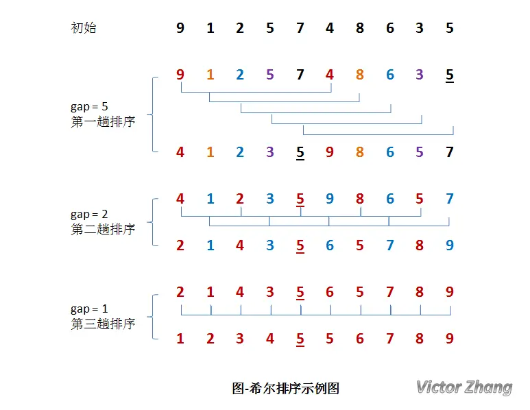
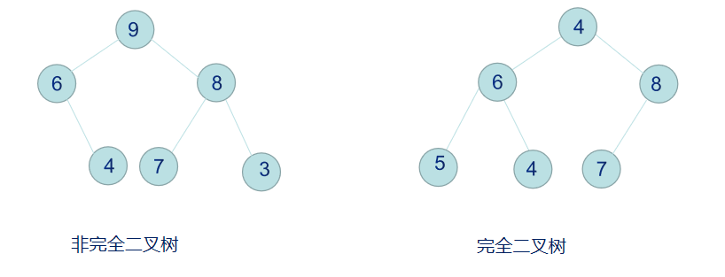
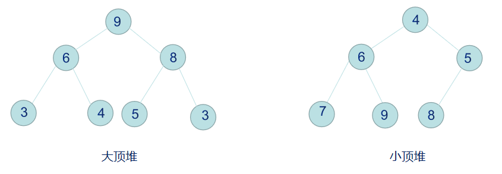
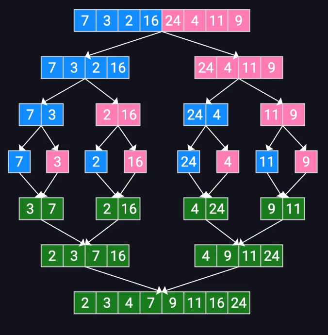

+++
title = '排序算法总结'
date = 2024-12-12T10:41:27+08:00
draft = false
description = '简单总结了常见的排序算法'
slug = 'sort-methods'
tags = ['算法']
categories = ['技术']
image = ''
license = false
+++

## 插入排序（Insertion Sort）


插入排序可以说是最直观的排序算法，简单而言，假设该位置的元素之前已经为排序好的升序，那么我将该元素从此位置依次从后往前与排序好的元素比较，如果更小，则交换，直到找到比该元素小的。

需要两层循环，第一层循环从第二个元素开始递增，循环变量`i`，`arr[i]`即找到本次需要被插入的元素。

第二层循环从该元素位置开始，循环变量`j`，比较该位置元素`arr[j]`和前一个元素`arr[j-1]`，如果符合条件，则交换，然后递减，直到比较到第2个元素`arr[j=1]`和第1个元素`arr[j-1=0]`。所以是j大于0截止。

### 代码实现

```java
public static void insertionSort(int[] arr) {
    for (int i = 1; i < arr.length; i++) {
        for (int j = i; j > 0; j--) {
            if (arr[j] < arr[j - 1]) {
                int temp = arr[j];
                arr[j] = arr[j - 1];
                arr[j - 1] = temp;
            }

        }
    }
}
```

### 复杂度分析

时间复杂度：

最坏情况：$O(n^2)$

即每个位置的元素都需要和前面的元素交换一次，总操作次数为：
$$
0 + 1 + 2 + 3 +...+ n = \frac{1}{2}n (n -1) \\
O\left(\frac{1}{2}n (n -1)\right) =O(n^2)
$$
最好情况：$O(n)$

平均：$O(n^2)$

空间复杂度：$O(1)$

只有交换时产生额外空间，所以是$O(1)$

## 希尔排序（Shell Sort）

在我理解中，直接插入排序可以看作是希尔排序`gap`为`1`的情况。

**希尔排序的`gap`,减为`1`时，就退化成直接插入排序；反过来将，如果将直接插入排序中循环变量涉及到的增量和起始量换成`gap`，再让`gap`减为`1`，不就进化成了希尔排序了吗**

希尔排序简单来说就是将数组进行分组后，对每个组进行一次插入排序，分组数量不断减少，直到减少到`1`，退化为直接插入排序。



如对于图中例子，初始数组为[9,1,2,5,7,4,8,6,3,5]， 每次按照gap对数组进行分组，每次分组排序结束后，gap减半，直到减为1。

第一次分组：gap = length/2 = 5，分为(9,4), (1,8), (2,6), (5,3), (7,5)子组，然后对这些子组分别进行一次插入排序。

第二次分组：gap = gap/2 = 2，分为(4,2,5,8,5), (1,3,9,6,7)两组，然后对这两个子组进行插入排序。

第三次分组：gap = gap/2 = 1。退化为直接插入排序。排序后得到结果。

### 代码实现

代码实现上，因为直接插入排序即`gap = 1`时的希尔排序，我们可以反过来看，那么希尔排序不就是将直接插入排序中的本来为`1`的间隔替换为不同的`gap`吗？所以我们可以将直接插入排序的代码中，循环变量涉及到的增量和起始量替换为`gap`，并且在外层套一个递减`gap`的循环，这样就可以得到希尔排序算法代码。

```java
public static void myShellSort(int[] arr){
    int n = arr.length;
    for (int gap = n/2; gap>0; gap /= 2){
        // 下面的代码即将直接插入排序的代码中的递增量和起始量换成了gap
        for (int i = gap; i < n; i++){
            for (int j = i; j>= gap; j -= gap){
                if (arr[j] < arr[j - gap]) {
                    int temp = arr[j];
                    arr[j] = arr[j - gap];
                    arr[j - gap] = temp;
                }
            }
        }
    }
}
```

### 复杂度分析

最坏情况：$O(n²)$，在某些情况下，性能接近于插入排序。

平均情况：$O(n^{\frac{3}{2}})$，具体取决于间隔的选择。

最好情况：$O(n)$，当数组已经接近排序时。

**希尔排序平均时间复杂度比直接插入好的原因可以理解为：在开始时，对数组进行较多分组后插入排序，操作次数少的同时，减少了数组中的乱序性；到分组变少后，虽然每个组中的数更多了，但是由于数组的整体乱序性已经降低，所以操作次数也会变少。**

空间复杂度：O(n)

稳定性：不稳定（分组时，可能两个相等的元素在不同组，从而会出现顺序变换的情况）

## 选择排序（Selection Sort）


选择排序是一种非常简单和直观的排序算法，即从未排序的数组中找到最小的元素，放在已排序的数组之后。

### 代码实现

```java
public static void selectionSort(int[] arr){
    for (int i = 0; i< arr.length; i++){
        int minIndex = i;
        for (int j = i + 1; j < arr.length; j++){
            // 找到未排序序列中最小的元素索引
            if (arr[j] <= arr[minIndex]){
                minIndex = j;
            }
        }
        // 交换第一个未排序的元素和最小元素
        int temp = arr[minIndex];
        arr[minIndex] = arr[i];
        arr[i] = temp;
    }
}
```

### 复杂度分析

无论什么样的数组，都会是$O(n^2)$的时间复杂度

## 堆排序

参考：[三分钟玩转堆排序原理及面试题（多图解释+Python实现） - 极术社区 - 连接开发者与智能计算生态](https://aijishu.com/a/1060000000090217)

堆排序是基于堆，一种完全二叉树的数据结构的高效排序算法。

### 堆

堆实际上是一个完全二叉树数据结构。即除了最下面一层以外，其余各层的结点都达到最大个数，最下面一层的所有结点都连续集中在最左边。



堆分为：大顶堆和小顶堆

+ 大顶堆：最大元素在根结点
+ 小顶堆：最小元素在根结点



### 堆排序

堆排序的思路很简单：即从大顶堆中弹出最大的元素，然后将最后一个元素放在空出来的根节点，调整剩下的堆序性，再弹出次大的元素，重复这个过程，最后便得到有序的序列。考虑到空间复杂度，弹出的元素并不需要存放在新开辟的空间中，可以直接与最后一个元素交换位置，调整剩下的堆。整个过程如下：

1. 将未排序的数组构造成大顶堆
2. 将大顶堆的根元素与堆的最后一个元素交换，调整剩下的堆
3. 重复2

最终堆数组便成为了一个升序的数组。

#### 代码实现

主逻辑

```java
static void heapSort(int[] arr){
    int n = arr.length;
    // 构造大顶堆，从最后一个父结点开始自下而上下沉
    for (int i = n / 2 - 1; i>=0; i--){
        heapify(arr, n, i);
    }

    // 弹出交换 调整堆
    for (int i = n-1; i>=0; i--){
        swap(arr, 0, i);
        heapify(arr, i, 0);
    }
}
```

细节：

+ 构造堆的方法为**自下而上的构造法**，从最后一个父结点开始，进行下沉操作，每次下沉后，将操作过的子结点看作父节点进行递归，以保证所有子堆都满足堆序性

构造堆递归方法：

```java
static void heapify(int[] arr, int n, int i){
    int largest = i;
    int left = 2 * i + 1;
    int right = 2 * i + 2;

    // 找到父结点、左右结点中最大的元素
    if (left < n && arr[left] > arr[largest]){
        largest = left;
    }
    if (right < n && arr[right] > arr[largest]){
        largest = right;
    }
    // 如果父结点不为最大，交换；并对交换后的结点进行下沉优化
    if (largest != i){
        swap(arr, i, largest);
        heapify(arr, n, largest);
    }
}
```

踩坑：

```java
if (arr[right] > arr[largest] && right < n){
    largest = right;
}
```

应该先判断`right < n`再`arr[right] > arr[largest]`，否则会越界

## 冒泡排序（Bubble Sort）


冒泡排序虽然叫做冒泡，听起来像是操作一个最大元素上浮，但是实际上操作的对象是一个移动的框，依次移动这个框，然后判断框内的元素是否符合大小顺序，如果不符合则交换，符合则将框后移，直到移动到已排序的元素之前停止。

### 代码实现

```java
public static void bubbleSort(int[] arr){
    for (int i = 0; i < arr.length; i++) {
        for (int j = 0; j < arr.length - i - 1; j++){
            if (arr[j] > arr[j +1]){
                int temp = arr[j];
                arr[j] = arr[j+1];
                arr[j+1] = temp;
            }
        }
    }
}
```

### 复杂度分析

**时间复杂度**：

- 最坏情况：$O(n^2)$
- 平均情况：$O(n^2)$
- 最好情况：$O(n)$

**空间复杂度**：$O(1)$

## 快速排序

参加：[Improvement on the Quick Sort Algorithm - GeeksforGeeks](https://www.geeksforgeeks.org/improvement-on-the-quick-sort-algorithm/)

+ 分治
+ 递归

快速排序的基本思想为选取一个基准元素，然后将数组分为小于基准元素和大于基准元素的两部分，并对分出来的两部分进行同样的操作，直到无法再分。

可以使用这个题来进行测试 [912. 排序数组](https://leetcode.cn/problems/sort-an-array/)

### 代码实现

此版本为最基础的版本，采用递归。

+ `quickSort(int[] arr, int left, int right)`: 递归入口

+ `partition(int[] arr, int left, int right)`: 核心方法，负责对传入的数组进行划分，得到划分后的基准元素索引和数组。
+ `swap(int[] arr, int i, int j)`: 交换两个元素位置

对于一个数组，传进`quickSort()`方法后，先进行划分，得到划分后的数组和基准元素的索引，然后再根据基准元素索引数组分为两个子数组，分别递归`quickSort()`方法。递归退出条件为当传入的数组只有两个元素且顺序正确，此时`left = right`。

```java
public static void quickSort(int[] arr, int left, int right){
    // 递归退出条件：最深层穿进来的数组的左索引 = 右索引
    if (left < right){
        int pivotIndex = partition(arr, left, right);
        quickSort(arr, left, pivotIndex - 1);
        quickSort(arr, pivotIndex + 1, right);
    }
}

private static int partition(int[] arr, int left, int right) {
    int pivot = arr[left]; // 最左元素为基准元素
    int lastIndex = left; // 最后一个小于基准元素位置
    for (int i = left + 1; i <= right; i ++){
        // 判断arr[i]是否小于基准，如果小于则交换上一个和这个的位置
        if (arr[i] < pivot){
            lastIndex ++; // 右移到下一个即第一个不小于基准元素，然后交换
            swap(arr, i, lastIndex);
        }
    }
    // 将基准放在最后一个小于其的位置
    swap(arr, left, lastIndex);
    return lastIndex;
}

private static void swap(int[] arr, int i, int j) {
    int temp = arr[i];
    arr[i] = arr[j];
    arr[j] = temp;
}
```

**问题**

在测试过程中，遇到了两个极端测试样例

```java
arr1 = [3,2,2,2,2,2,...,2];
arr2 = [2,2,2,2,2,2,...,2];
```

即大量重复元素问题，由于每次选择的是第一个元素为基准元素，并且是简单的单向指针，所以对于重复元素数组，每次分区之后都会分成N-1和1，因此整体时间复杂度将为$O(N^2)$会超出时间限制

### 改进

#### 随机选择基准

基础算法中，基准选择是直接选择数组第一个元素，那么如果数组已经是有序或者逆序，则每次分区都会是极端情况，算法复杂度会非常高。

#### 采用双指针对分区步骤进行改进

在基础的分区算法中，是从最左边元素开始进行遍历，与基准值比较后进行交换。改进思路：采用双指针，从两端开始扫描元素，分别找小于基准和大于基准的元素进行交换，直到两个指针反转，最后将基准元素和任一分区靠近中间的端点交换。

改进后的分区方法如下：


```java
public static void quickSort(int[] arr, int left, int right){
    // 递归退出条件：最深层穿进来的数组的左索引 = 右索引
    if (left < right){
        int pivotIndex = partition(arr, left, right);
        quickSort(arr, left, pivotIndex - 1);
        quickSort(arr, pivotIndex + 1, right);
    }
}
```

注意这里有一个非常容易才坑的地方，即得到`pivotIndex`之后，分区是否要包含`pivotIndex`所在的元素。

如果`partition`方法中，返回的index的的确确是真正的pivotIndex，那么之后的分区可以不包含，例如基础快排中方法中，在方法末位我们将基准元素放到了lastIndex并返回，所以返回的就是真正的pivotIndex

```java
private static int partition(int[] arr, int left, int right) {
    int pivot = arr[left]; // 最左元素为基准元素
    int lastIndex = left; // 最后一个小于基准元素位置
    for (int i = left + 1; i <= right; i ++){
        // 判断arr[i]是否小于基准，如果小于则交换上一个和这个的位置
        if (arr[i] < pivot){
            lastIndex ++; // 右移到下一个即第一个不小于基准元素，然后交换
            swap(arr, i, lastIndex);
        }
    }
    // 将基准放在最后一个小于其的位置
    swap(arr, left, lastIndex);
    return lastIndex;
}
```

但是如果`partition`方法中，返回的index的并非真正的pivotIndex，例如网上许多Hoare’s Partition的代码中，返回的是小于基准元素的自区间的最后一个元素的位置，并非Pivot Index。例如这个代码[Hoare's vs Lomuto partition scheme in QuickSort - GeeksforGeeks](https://www.geeksforgeeks.org/hoares-vs-lomuto-partition-scheme-quicksort/)

```java
/* This function takes first element as pivot, and
   places all the elements smaller than the pivot on the
   left side and all the elements greater than the pivot
   on the right side. It returns the index of the last
   element on the smaller side*/
static int partition(int[] arr, int low, int high)
{
    int pivot = arr[low];
    int i = low - 1, j = high + 1;

    while (true) {
        // Find leftmost element greater
        // than or equal to pivot
        do {
            i++;
        } while (arr[i] < pivot);

        // Find rightmost element smaller
        // than or equal to pivot
        do {
            j--;
        } while (arr[j] > pivot);

        // If two pointers met.
        if (i >= j)
            return j;
        int temp = arr[i];
        arr[i] = arr[j];
        arr[j] = temp;
        // swap(arr[i], arr[j]);
    }
}

/* The main function that
   implements QuickSort
arr[] --> Array to be sorted,
low --> Starting index,
high --> Ending index */
static void quickSort(int[] arr, int low, int high)
{
    if (low < high) {
        /* pi is partitioning index,
        arr[p] is now at right place */
        int pi = partition(arr, low, high);

        // Separately sort elements before
        // partition and after partition
        quickSort(arr, low, pi);
        quickSort(arr, pi + 1, high);
    }
}
```

待排序数组：[4, 1, 3]

第一次循环，选取pivot为4，左指针在4停止L=0，右指针在3停止R=2，交换得到[3, 1, 4]

第二次循环，左指针L继续扫描，在4停止L=2，右指针在1停止R=1，满足相遇条件，返回R=1

**此时返回的就不是真正的pivot位置，而是小于pivot的分区的末位位置，所以在主方法中，得到`partition`返回的index之后，分区递归调用时，不能将返回的index排除在外**

```java
quickSort(arr, low, pi); quickSort(arr, pi + 1, high);
```

而非

```java
quickSort(arr, low, pi - 1); quickSort(arr, pi + 1, high);
```

当然，如果写的Hoare’s Partition的`partition`方法最后是将基准元素放在两个分区之间后再返回真正的Pivot Index，则递归主方法在进行分区调用递归时，可以不包含Pivot元素。但是这样的话`partition`方法的逻辑上会相对更复杂，需要保证相遇情况下，右指针一定要指向小于基准元素分区的最后一个元素位置。

如在我写的方法中，随机选择pivot后，将其交换到最左边，然后对剩下的数组进行分区划分，但是这样情况下，剩下的数组里可能不会出现pivot，左右指针可能会出现越界情况，所以为了防止越界，我进行了两个越界判定。将左指针的最大设置为right，右指针最小设置为left，这里之所以不将右指针最小设置为left + 1，正是为了保证在极端情况下（如所有元素都大于pivot）右指针最后能指向pivot，这样才能保证最后在将pivot和右指针交换时`swap(arr, left, rP);`，不会出错。：

```java
static int partitionImprove(int[] arr, int left, int right) {
    Random r = new Random();
    int pivotIndex = left + r.nextInt(right - left + 1);
    swap(arr, pivotIndex, left);
    int pivot = arr[left];
    int lP = left + 1;
    int rP = right;
    while (true) {
        while( arr[lP] < pivot && lP < right){
            lP++;
        }
        while( arr[rP] > pivot && rP > left){
            rP--;
        }
        if (lP >= rP){
            break;
        }
        swap(arr, lP, rP);
        lP ++;
        rP --;
    }
    swap(arr, left, rP);
    return rP;
}
```

举个例子：

待排序数组：[3,4] left = 0, right = 1

随机选取pivot为3并将其交换到首位，此时数组：[3,4]

第一次循环，左指针从索引1开始扫描，3=pivot，停止，L=1；右指针从right扫描，由于将pivot位置也即索引0位置包含在右指针扫描范围中，所以右指针最终停止在0位置，R=0；左右指针相遇，推出循环。

交换pivotIndex(0)和R(0)，没问题。

但是如果由于将pivot位置也即索引0位置没有包含在右指针扫描范围内，则R会在1位置停止，此时也满足L==R，左右指针相遇。此后再交换

交换pivotIndex(0)和R(1)，那么pivot就会换走，此时返回的R位置虽然是pivot的位置，数组变为[4,3]，但是大于pivot的元素4已经被换到pivot（3）之前了。

**所以分区方法中，如果是将随机选出来的基准元素放在最左边，并对剩下的元素进行扫描时，那么一定要保证右指针的扫描范围也要包含基准元素。（如果将基准元素放在末尾，则需要对左指针进行同样的操作）**

##### 三向分区

为了有效地将具有大量重复键的阵列排序，可以讲分区分为三部分，严格小于基准、等于基准、大于基准

**未完待续**

## 归并排序

核心操作：

合并两个有序数组

核心思想：

分而治之



### 代码实现

合并操作

思路：

+ 三个指针分别扫描left、right、arr
+ 比较扫描到的left和right的元素，将更小的放进arr
+ 直到left或right扫描结束
+ 将left或right中剩下的元素放进arr

分治递归

思路：

+ 将数组分为两部分，分别进行分治，递归直到数组只剩下一个元素，然后将反过来合并，直到退出

```java
static void mergeSort(int[] arr) {
    int n = arr.length;
    int mid = n / 2;
    // 退出判断
    if (n <= 1) {
        return;
    }
    int[] left = new int[mid];
    int[] right = new int[n - mid];
    System.arraycopy(arr, 0, left, 0, mid);
    System.arraycopy(arr, mid, right, 0, n - mid);
    mergeSort(left);
    mergeSort(right);
    merge(arr, left, right);
}

static void merge(int[] arr, int[] left, int[] right) {
    int i = 0, j = 0, k = 0;
    while (i < left.length && j < right.length) {
        if (left[i] <= right[j]) {
            arr[k] = left[i];
            k++;
            i++;
        } else {
            arr[k] = right[j];
            k++;
            j++;
        }
    }
    // 处理有剩余的元素
    while (i < left.length) {
        arr[k] = left[i];
        k++;
        i++;
    }
    while (j < right.length) {
        arr[k] = right[j];
        k++;
        j++;
    }
}
```
