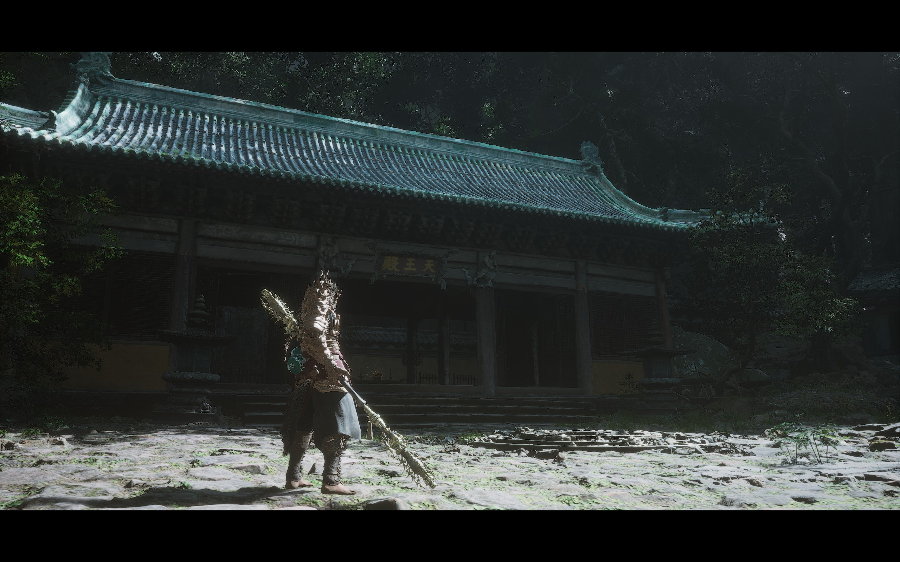
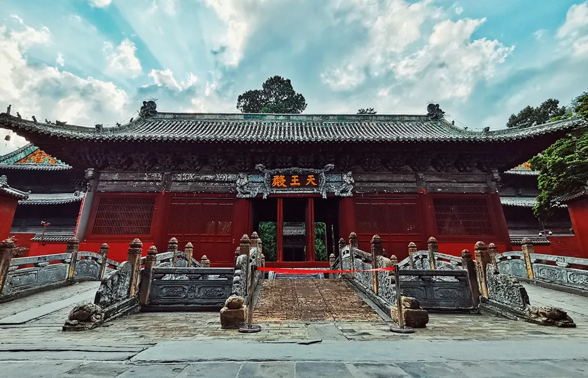
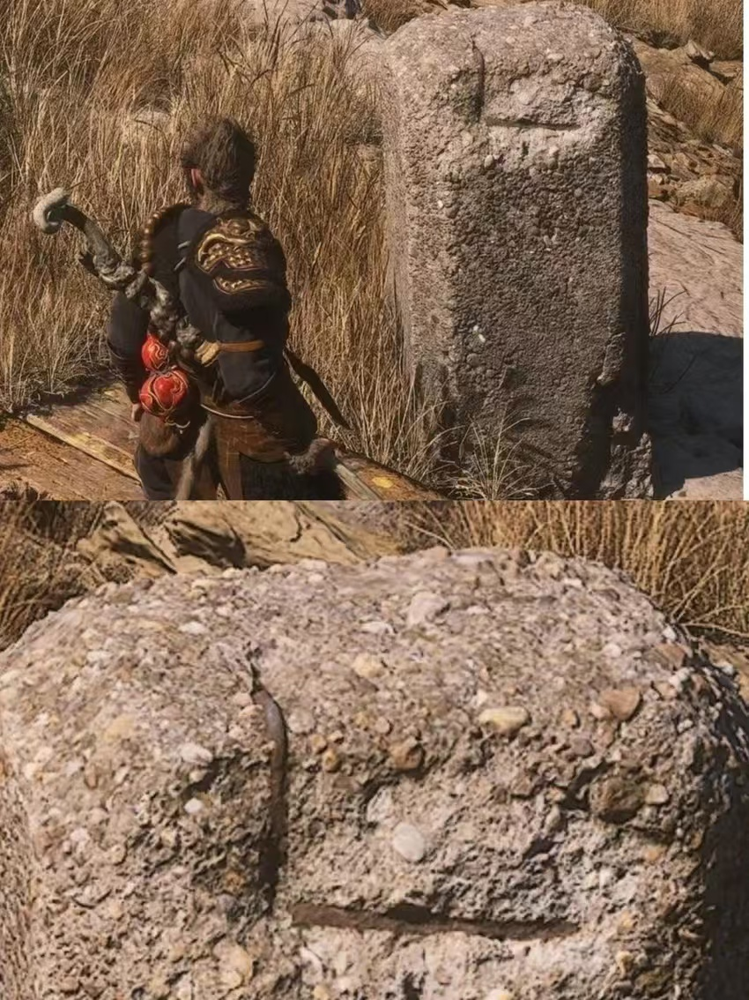
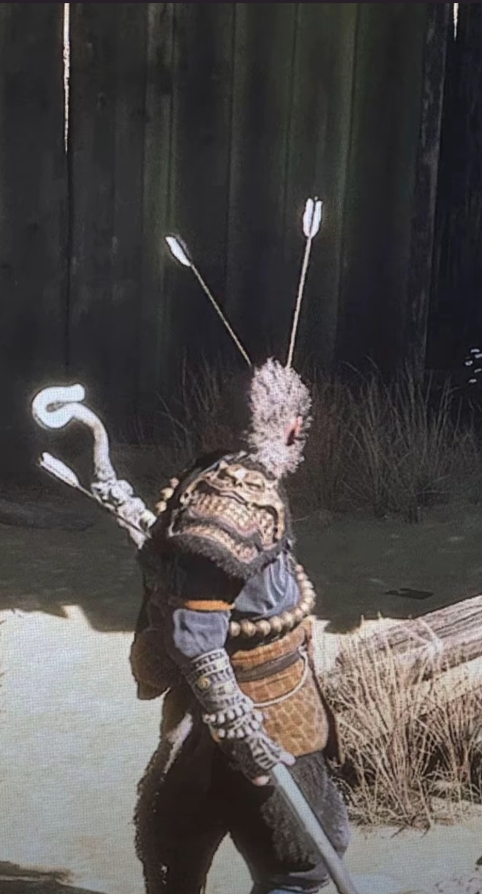

+++
title = '黑神话：悟空'
date = 2024-09-13T22:53:35+08:00
draft = false
description = '通关之后的一些碎片感想'
slug = 'BMW'
tags = ['黑神话：悟空']
categories = ['游戏']
image = ''
license = false
+++

**内容涉及剧透，还未体验的朋友谨慎阅读**

-------------------------

47小时后，跌跌撞撞的还是通关了。到最后一章花果山顶石头前，迟迟不想按下进入大圣记忆的`RT`键，不想旅程就如此快的结束，我想这可能也是许多玩家玩到这里的想法。不过一旁八戒的话却时刻透露着想要复活大师兄的焦急，对他而言旅程还仍会继续，对我而言旅程即将结束（除非游科赶紧把DLC端上来！）

## 好玩否？

记得冯骥曾说“游戏最重要的是，它得好玩”。黑神话在我玩下来，的确做到了这一点。在整个游玩过程中，它总一直会有许多吊足胃口的方面，不断给予我玩下去的吸引力。

最直接的一点是：试问哪个小朋友能在如此美丽的画面，操控如此帅的大圣的情况下而不感到激动呢？

> 序章图

## 故事剧情

最大的一点吸引是剧情，或者说是我对黑神话所展现的后西游故事的好奇。说来惭愧，到游玩前我也还没有真正去读过《西游记》的原文（不过最近也开始去补《西游记》原文了）。对西游故事的了解，还是儿时从86版《西游记》中吸取的断断续续的碎片。那时候对《西游记》的感受就是师徒四人遇到一难、搬救兵借法宝、解决一难、再遇到一难，如此循环，直到取到真经，这似乎是一个中国神魔版的公路片？而且当时对师徒四人的看法也是十分简单，简单的就像小时候问总会问家长的一个问题“这个人是好人还是坏人？”所以总结下来，儿时对于西游记的印象，仅仅是一个好人团队一路打败坏人的故事。而慢慢长大，接触到一些《西游记》的二创、解读，才慢慢意识到，《西游记》并非儿时认为的那般简单的打怪故事。而我也对这些二创或深度的解读非常感兴趣，就像看完《让子弹飞》之后痴迷的去看了许多对其的解读一样。所以在游玩《黑神话》的过程中，对我最大的吸引便是游科会如何讲其黑神话的剧情。

游玩下来游科并没有让玩家或者说让我失望。无论是后西游故事的续写、对于原著剧情人物的合理改变和背景丰满、以及世界观的丰富，都令我十分陶醉。

整个流程下来，给我留下深刻印象的地方太多。第一章的“若不披上这件衣裳，众生又怎知我尘缘已断，金海尽干”、第二章的“我来助你”、第三章黄眉倒果为因、第四章八戒和紫蛛儿爱而不得“戒网”剧情、第五章牛魔王一家被卷入东西天之间的冲突中进退两难的悲剧（就像身本忧中两头猪并封，进退两难）、二郎神和大圣的心心相惜（让我好生欢喜！）、大圣的布局、石子石父石母（杀父杀母仇人就在眼前，却能埋藏恨意装傻拍手，心有惊雷而面如平湖，这般心性，此子断不可留，杀人者非我也，广智也）、通臂猿猴（最后一段，虽不能言，但其悲喜能透人心）、小狐狸与不空、马天霸（老马啊！老马）、牛先锋（你是个顶好的猴头）、四妹（可是她叫我臭猴子，游科DLC能不能让我打上天庭）、萍萍（虽然知道是红孩儿假扮，可是他一声声叫我猴哥哥）……还有许多写在影神图中小妖的有趣故事（比如罗刹宫将牛侍长一把抱住的牛校卫，当时看到笑死我了）

游科讲故事的方式也做到了在完完整整全盘托出与隐晦零散草蛇灰线之间的完美平衡。相较于老头环将整个故事拆分成零散的碎片、然后挑出部分埋在对话、物品描述、及其稀有的CG中、给予玩家非常庞大的讨论和想想空间的做法，我更喜欢游科讲故事的方式。我很喜欢老头环十分宏达且震撼的故事，但是想要感受到这样的震撼，仅仅靠自己体验完一次游戏是很难的。真正在我游玩的过程中，我几乎很难摸清整个故事的脉络，在许多时候能感受到的是，这个人或者这件事背后深深的神秘感，故事一定会比我所想象的更加复杂且深邃。这样的神秘感会在通关并且在社区细细看了大神的总结和分析，了解到整个故事的脉络后，得到释放，并且会深深震撼于老头环整个故事和世界观的架构，以及各个人物角色身后充满宿命或悲剧般的故事（尤其是蒙葛特与蒙格两兄弟的故事，老葛家满门忠烈！）。但是这样的震撼是我在游戏流程中或者一周目中很难体会到的。而游科《黑神话》的讲故事方式，便能让我在第一次的游玩过程中，体会到这样的震撼。一方面是原本就有对着西游故事的一定熟悉，另一方面是对于能直接打动玩家的故事剧情，游科用CG、章末动画来将这份打动与震撼直接呈现在玩家面前，而对于较为深邃的暗线，游科也通过草灰蛇线的方式埋在了游戏中，给予玩家一定的神秘感和想象空间。

另外，《黑神话》中不仅各个配角NPC都有着自己背后的故事，甚至连路上遇到的每一种小怪都有着其自己的故事。在每击杀一种新的小怪后，影神图中便会解锁这个小怪的故事，游科不仅为每个小怪写了一个或寓言风格，或交代世界观的故事，还给小怪配上了一首概括的小诗以及插图。玩家不会觉得小怪是用来放在路上充数提供灵韵的。这极大完整了整个故事的世界观，也极大增加了玩家游玩游戏时的代入感，似乎《黑神话》里的世界，就是一个真实存在的世界。

> 影神图

## BOSS

《黑神话》的Boss战无疑是每个章节最令我期待的事情。整个流程中有时候我会沉浸在欣赏Boss大开大合的流畅帅气招式中，即使一次次的死亡。尽管有一些Boss打起来会让我觉得很难受，甚至有一些会让我感觉很“粪”，而这些主要是一些大体型的或非人型的Boss，例如魔将·妙音，百眼魔君。其中原因有很多：Boss体型大，视角锁定便会不便；Boss体型大了之后，其招式攻击范围大，攻击频率低，不够帅，往往是大范围下砸、横扫、冲撞，让我很难躲避同时交互性很差，往往就是躲一下；Boss体型大之后，由于视角和体型遮挡，有时难以看清出招前摇；Boss自身有空气墙（点名百眼魔君）……同时一些机制Boss也会令人打起来难受或者无趣，比如魔将·莲眼（基本都是在躲弹幕）、音游小骊龙、大石敢当。

但是除此之外，类人型的Boss设计上便十分出彩。在攻克这些Boss过程中我往往会在惊呼“好帅，还有这招”后死掉。如老少虎先锋大开大合，拳拳到肉的力量感、寅虎极具重量感和力量感的大刀招式，不能刚劲有力并且凌厉无比的拳法和腿法，小黄龙风驰电掣而丰富的流畅刀法、毒敌大王（其招式的设计非常符合其蝎子精的定位，尾巴和右手钳的招式设计的非常棒，虽然卡了我很久）、夜叉王（没说的就是帅）、二郎神灵活多变，各种武器法宝变幻莫测、以及最后大圣残躯像老师傅喂招似的切磋……这些Boss就算打的时候会让我经历一次次挫败去熟悉他们的招式，但是却会让我更加喜欢这些Boss的设计，更喜欢这个游戏。同时，在一次次倒下重生，熟悉了Boss招式并击败后，那种痛快感难以言说（上次这样的痛快感还是魂3过米宝的时候）。

另外，游科的Boss设计，在很多地方非常贴合Boss本身的特性。例如身为蝎子精的毒敌大王，游科围绕其尾巴设计了许多招式；青蛙们的招式更多围绕有力的后腿和舌头（我相信没有人没尝过几乎零帧起手的双腿蹬）；石头精怪们的笨重；晖月魔君许多动作非常符合现实中大公鸡的形神……

## 战斗与难度

我个人非常喜欢《黑神话》的战斗系统。我自己玩过的动作类游戏不算多，《黑暗之魂3》、《艾尔登法环》、《战神》、《巫师3》（如果巫师3算的话）。但是综合下来，我觉得《黑神话》的战斗系统与难度设计是我最喜欢的。

刚开始上手时，我的战斗思维还是局限在魂游那种拉开距离，躲掉Boss攻击，在间隙偷几刀，然后继续等待时机。这样的战斗思维在遇到第一个Boss幽魂（对不起牯护院，你太弱了）时候吃尽了苦头。幽魂或者说大头的攻击对于刚刚踏入旅途的天命人来说太强了，基本两三下就一条命，但是他吃硬直，一套轻击接终结技的话刚好能打出一套硬直。但是由于我刚开始玩还是像魂一样先拉开等待大头出招，闪躲之后再找机会A几下，这样的方式由于不熟悉大头攻击手段，导致很容易就死掉。在尝试好几次之后，在同学的点拨下，才意识到要主动上去打压制，通过轻棍终结技和定身术压制输出。这才慢慢过掉幽魂。

《黑神话》的战斗系统非常丰富，三种棍势都有自己的派生切手技，再加上四种类型的法术、数十个精魄化身、以及不同兵器和披挂和丹药带来的不同增益，极大丰富了旅途。

整体而言我认为《黑神话》的难度并不算太高。游戏前期出了不熟悉游戏机制而卡了十几条命的大头以外，其他的Boss并没有卡很久。白衣秀士两次过，黑风大王和黑熊精都是一次过，虎先锋三次过。直到游戏中期才遇到一些卡了挺久的Boss。魔将·妙音是一个，打的太难受了，但是我怀疑卡在这里的原因是由于我太困了，在我尝试了一下午没有成功后，去床上眯了一会，下来第一把就过了。青背龙小卡了一会，不过很快就能熟悉他的招式，熟悉后很简单就可以过。真正难打的是毒敌大王、小黄龙和二郎神，这几个Boss平均每个可能都花了一两个小时才能过掉。

不过我仍然认为这样的难度是很好的。即使毒敌大王、小黄龙、二郎神和寅虎这些Boss可能需要一两个小时才能过掉，但是我相信每一个过掉这些Boss的玩家当时内心一定被成就感和激动所充满，并且十分想要再次挑战这些Boss。在攻略这些Boss的过程中，其带给我的成长正反馈是非常强的。从初见几招就被秒掉，到慢慢熟悉Boss的招式，知道这个抬手是对应哪个招式，下一招是快是慢，哪一招是投技必须躲开，哪一招可以识破……又到开始调整自己的加点，改变打法，尝试不同的棍法和法术，是通过定身术、聚形散气、变身快速消耗，还是禁字决一开，来一场真男人的1v1……无论是怎样，当我通过不断试错熟悉学习过掉这些Boss后，那种激动和成就感无以言表。

另外，我十分喜欢《黑神话》在土地庙能够无代价的洗点的设计，这极大促进了玩家针对不同的Boss尝试组合不同的打法流派，从而发掘更多游戏的乐趣。虽然我仍然是一个非常懒的去研究不同打法的人，但是在游戏慢慢推进到中后期，我发现我不得不去研究这些不同的加点和棍法流派，才能更好的推进游戏。一直到第三章，我的打法仍然是只用劈棍，识破都没有点，有积累的棍势我就跳跃轻击接重击后快速用掉。在前面两章这样的打法还是挺好用，但是到后面发现越来越局限，于是我开始尝试使用识破，便发现了新大陆，后面就一直用劈棍识破。直到毒敌大王我发现这个酗酒男人攻击范围太大了，识破也不好识破，于是我尝试了戳棍的退寸进尺，然后过了。不过我还是钟爱我的劈棍，一直用劈棍打到了大圣。

但是有一个很奇妙的事情，在我和小伙伴们的交流中，我发现大家卡关的Boss很多都不一样，有的人卡在A过不去，B反而很快就过去，而有的人A很容易过，B反而卡很久。我想可能这在另一方面确实体现了《黑神话》Boss设计的多样性。

## 美术

一直到真正亲手玩到《黑神话》之前，我能无法想象国产的第一个3A游戏的美术，能做到如此精美、具有真正的中国风格。哪怕在游戏发售前，已经有数个实机演示像我们展示了游戏中的精美画面和美术，但是真正操控天命人漫步在“雨过天连青壁润，风来松卷翠屏张”的黑风山中，细细端详散落在山中的佛像、边查字典边阅读禅院两侧的楹联、在崖边的蒲团打坐时，黑风山的景色仍然能带给我无比的震撼。而游戏中的兵器、披挂、各种道具、葫芦、仙酿的精美建模，也让我时不时都会停下来仔细端详。

另外《黑神话》的拍照模式真正做到了拍照模式应有的意义。之前玩过的许多游戏也有拍照模式，但是并不是有拍照模式的游戏就有值得拍照的景色或场景（大表哥2例外，大表哥神作！）。而《黑神话》有太多太多值得“在这停顿”并开始拍照的地方，无论是Boss战时的精彩瞬间，还是不同章节的旖旎风光（火焰山就算了）。但是一周目急于推图，并没有慢下来仔细欣赏和拍照，再者由于配置不够，也不能拍出最好画质下的照片，所以等以后升级配置，再在二周目慢慢游玩吧。

不得不提一下每个章节结束时听着老猴子讲述总结此章的故事，细细欣赏画卷是我最惬意也是最喜爱的部分之一。画卷画的都是此章在西游时候的故事。放大后还能看见非常多和原著以及本作相关的细节，并且在某些关键人物处，还有新的讲述（我恨不得每个人物出都能有讲述）。而在天命人重走西游之后再来回味，便有一种时过境迁，物是人非的悲感。而这部分的音乐也是我最爱一首：《静隐深山无俗虑》，尤其是弦乐部分出来之后，有一种冷寂而又宁静的感觉。这样的感觉突然让我忆起了动画《宝莲灯》的插曲（歪个题，《宝莲灯》也很好看，里面悟空的角色塑造也很丰富，而且陈佩斯的配音非常棒），记得小时候看宝莲灯听着里面的插曲也是这样的感觉，沉香独自在天庭、人间磨砺，面对自己难以反抗的敌人，也有一种隐隐的孤寂。而老猴子的娓娓道来，对此章节故事的精确概括和凝练，也非常到位。印象很深的是第四章曲度紫鸳（舌尝思）的总结：“可命运呐，就像爱人的舌头，嘴里一套，心里一套。哪怕亲口尝到，也不知到底是想要，还是不想要。”

游戏里有着太多太多实景扫描的建模，甚至在游戏里看到了小时候待的县城的寺庙取景（就是四妹炼丹那儿的天王殿，是平武县报恩寺天王殿取景），说起来很好笑，在县城待了数年，还没有进报恩寺看过天王殿，反而在《黑神话》里见着了。所以下次回县城不得不去参观下了。

实景扫描也有好玩的地方，有网友在黄风岭发现了钢筋混泥土（图源网络）。

## 音乐音效

> 奈何《黑神话》音乐播放器太庞大，只恨音乐未在网易云上线。

游戏开场除了大圣英姿和跳下悬崖后被筋斗云托起的场景外，背景音乐《英雄气概等时休》是给我留下震撼印象的另一个元素。整场序章战斗宏大、威压、壮烈的氛围离不开这首音乐的加成。而在整个游戏流程中，许许多多场景和战斗时，其背景音乐烘托的恰到好处。有许多音乐也给我留下了深刻的印象，比如急中生智时的广智主题曲《灵山莫远求》，几乎陪伴了整个流程。直到第四章击败小黄龙，音乐变成了《善恶若无报》，那时脑子里都是还差三豆，还差两豆，还差一豆，你完啦！而第二章灵吉菩萨的陕北说书，可以说是最让人眼前一亮（耳旁一亮）的曲子。大漠黄沙，配上粗犷有力的陕北说书，太般配，同时也感谢《黑神话》让我认识到了如此优秀的民间艺术（另外让我想起了之前就关注的一个民间音乐人张尕怂，最开始听黄风岭的音乐我还以为是他唱的）。

放一张黄风岭特色凤翅金冠图（图源网络）

另外每个章节最后的动画音乐也非常非常棒，音乐和动画剧情主题非常贴合，而冯骥的作词更是令人惊叹。

而不同Boss战斗时的音乐，除了烘托出Boss战斗时的宏大气氛以外，也给予了卡关的我一丝丝慰藉。

> 写这部分时候，去重新单独听了许多背景音乐，非常值得重新单独听一遍，可以听出许多游玩时没有注意到的细节和感受。

## 台词与配音

台词，是除美术外最能体现中式浪漫的部分。而《黑神话》的台词，无论是关键剧情的对话、还是如八戒一样路途上的闲聊吐槽，亦是战斗时的感叹言语，都不止做到了贴合人物，服务剧情，更是给人物和故事赋予了灵魂。

八戒可以说是我最喜欢的人物了，无论是取经（根）路上的各种吐槽，还是他突然情至深处的感叹（“我就不该随你再来这破落地方，来了就想起当年那些糟心事情。一去这么多年，也不知当年……罢，罢，不提了，事过无悔，事过无悔”），还是我也没说要听你非要讲的讲故事，其台词和配音都非常贴合本作中八戒的角色。除此之外，八戒的交互做得非常好，游戏中天命人各种各样的操作，都有可能触发八戒的吐槽，并且恰到好处的让我有时候恍惚似乎这并不是游戏，是真的有人在我旁边陪着我。有一次我对一个难缠的小怪（海上僧小怪版），我一直觉得这个怪很难打，所以想快速解决战斗，于是上来就给了一个定身术，结果八戒直接嘲笑吐槽道“诶嘿，你怕这泼怪，我看出来了！”，给我整尴尬了，我还是头一次被NPC整尴尬。另外一次打夜叉王时候，在他抬手瞬间定住了，差点挨了一下，正当我夸自己定的好及时时候，八戒说道“定的好！”，仿佛他真的能看出形势一样。乃至放铜头铁臂如果放早了没被撞倒，八戒也会吐槽“贤侄，放早啦”。

在游戏最后（剧透警告），进入大圣记忆，在老猴子说大师兄再无可能复生，天命人会传承大圣的根本和名号时，八戒悲愤到“你是说，让这小猴子顶替我师兄，他配吗”，但是真正当我们需要独自面对大圣残躯时，八戒不仅不放心他的天命人贤侄：“他一向木木樗樗的，我不放心，我同他一起去”，还说呼喊道：“小猴子，好侄子，打不过就跑，悟空的名头，咱不要也罢！”当时听到这里，已经泪目。

八戒还会讲故事，如果玩家跑掉了，他还会吐槽你不让他说完，如果回来，他还会继续讲。在他讲故事中，有一个非常泪目的故事，交代了为什么他会来帮助天命人，也交代了他为什么当初没有帮悟空对抗天庭的围剿（结合第五章悟空对牛魔王的帮助，非常泪目）：

>我那大师兄，虽得成正果，却总是闷闷不快。在灵山他不听如来讲经，也不接玉帝传下的御旨，甚是古怪。一日他命我（“命”字用的太好了）陪着饮酒，我俩从西牛贺州喝起，腾云驾雾，一路喝遍四大洲，灵山珞珈山，方寸山须弥山，还有老猪的福陵山他的花果山……那场酒喝得老猪我大醉不醒，睁开眼已是三界大乱，四处都说大师兄死了，还说是二郎神动的手，胡说！大师兄，谁能杀得死？定是那遭瘟的猢狲藏起来哄骗老猪！再后来，有只老猴子找上我，要我扶持什么狗屁天命人，说这天命人，就是找回大师兄的关窍，就你？你连大师兄屁股边上的一根毛都不如。以老猪的聪明伶俐，决不相信大师兄死了，老猴子的话嘛……不能不信，也不能全信。这叫顺水推舟，你只管跟着老猪，听凭老猪差遣。我倒要看看，他葫芦里到底卖的什么药。

## 章末动画

## 八十一成就

## 国人自己的游戏
