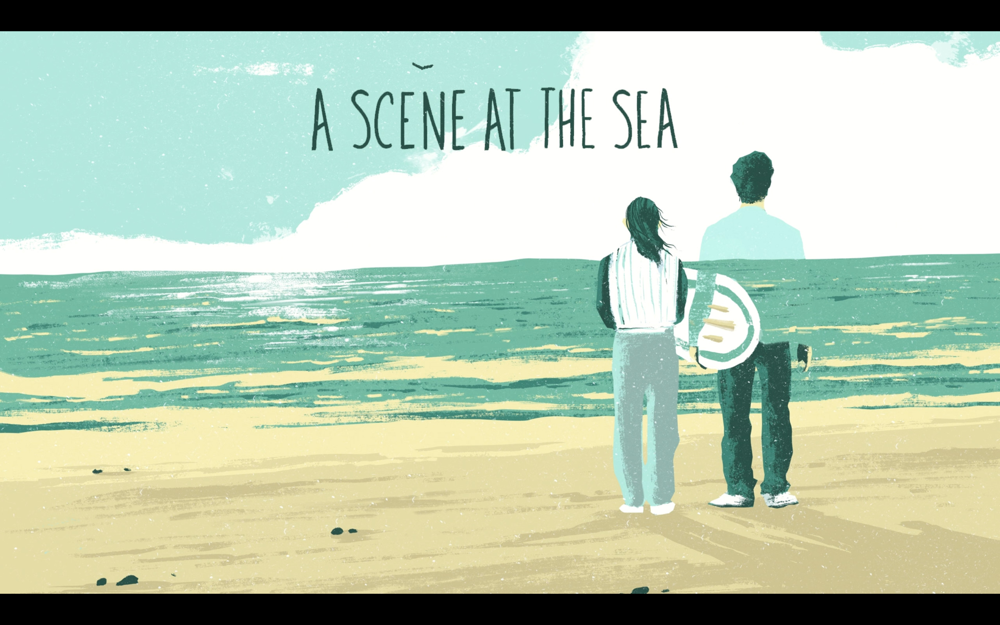
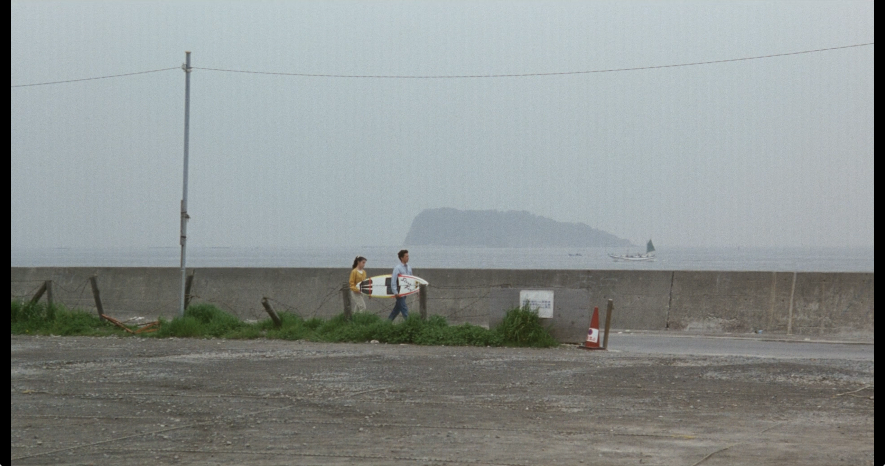
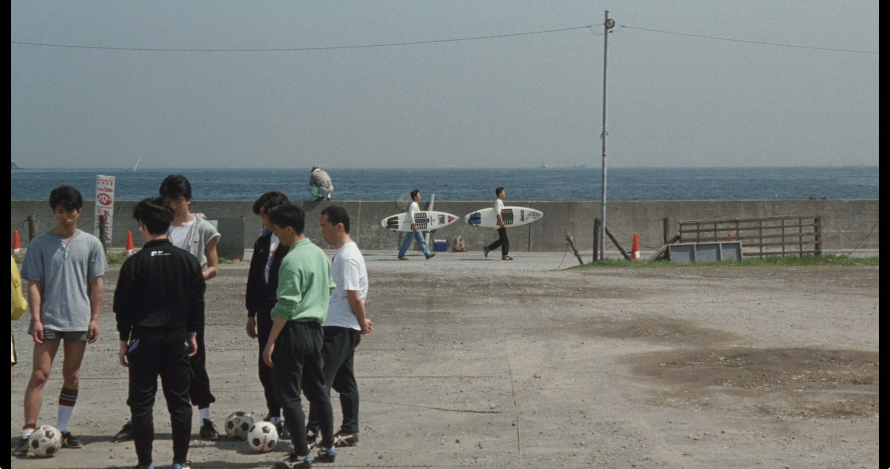
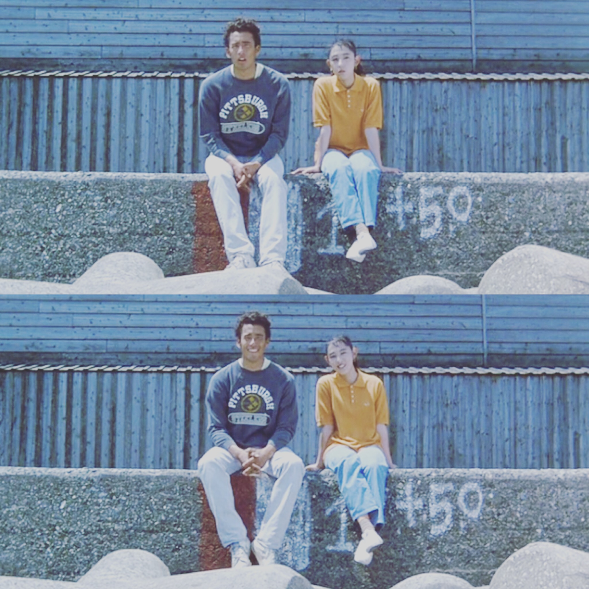

+++
title = '观影记录·待看清单'
date = 2024-09-21T10:41:40+08:00
draft = false
description = '记录一下近些年看过的一些印象深刻的电影。以及记录一些待看清单。'
slug = 'movie-records'
tags = ['电影']
categories = ['闲逛']
image = ''
license = false

+++
## 观影记录

### 大地惊雷 True Grit (2010)

观看时间：2024-9-20

推荐

剧情，科恩兄弟导演，剧情棒，摄影棒

### 三峡好人 (2006)

观看时间：2022年秋

推荐

贾樟柯导演，很真实乡土

### 路边野餐 (2015)

观看时间：2022年秋

推荐

梦幻离奇而又感动

### 燕尾蝶 スワロウテイル (1996)

观看时间：2022年秋

推荐

拍的非常美好，虽然剧情并不是美好

### 列宁格勒牛仔征美记 Leningrad Cowboys Go America (1989)

观看时间：2022年秋

推荐

幽默，荒诞，又有点还没想明白的隐喻和讽刺

### 那年夏天，宁静的海（1991）

观看时间：2024年秋

导演、编剧：北野武

与以往我看过的许多剧情片不同，《那年夏天,宁静的海》（后简称《海》）会挑出一些非常简短的碎片来展现整个故事，仿佛只要观众能自己推理想像出的剧情，导演都一并略去不讲。尤其是对于男女主茂和贵子的故事，导演略去了很多，例如他们是怎么认识的，平时的生活等等，导演只交代了和冲浪有关的两人的线索，但是整个电影看下来，仍然会被他们俩的爱情深深打动。最后看下来，我的感受却是“讲故事不需要娓一道来，事无巨细”。《海》许多时候仅仅是表现出关键的信息和故事的予盾点，而只要观众细心关注画面试听语言所展示的细节，便仍然能抓住故事，而此时故事却能更紧紧地抓住观众。同样的，在台词上，北野武也非常惜字如金，能三言两语便交代的剧情，绝不拖沓，能用镜头语言表现的故事，绝不用对白。这样的精炼，让观影的我需要非常仔细的关注每一个镜头，每一句台词，但同时也让我更加专注而深入的了解了故事。

而在一些侧面描写的地方，导演却又很舍得，例如在茂第一次参加比赛时，导演几乎将大部分的镜头都给到了比赛中，各个冲浪选手的表现，而给到茂的画面也仅仅是他和贵子在一旁默默等待，直到比赛结束，导演才从冲浪店长之口道出了是由于茂和贵子都是聋哑而没有听到茂上场的通知。这样的侧面镜头，第一时间观众（我）会一直疑惑与等待茂什么时候上场，第一次比赛会不会有特别的表现，而第二时间会被热闹与冷清的对比而触动，其他冲浪选手三五成群或是优异表现，或是相互嬉闹的热闹与茂，而茂和贵子却静静的等待，热闹与他们无关，正如对于聋哑的他们俩而言，周围是无声的安静。

《海》虽不是公路片，但是在观看的时候，我却感受到其有着公路片似的神韵。有着如公路片似的出乎主线以外的插入。北野武也很“调皮”，人物故事又是会先让你以为会这样发展，最后却是不按观众所料的展开。例如最开始嘲笑嬉闹茂冲浪的两个踢球的伙伴，本以为他们会是反面的角色会在之后在茂的冲浪路上产生一些阻碍，但是没想到他们却沿着茂追梦的足迹，最后继承了茂的梦想。在茂和贵子开始抱着冲浪板路过球场去海滩时，他们会嘲笑冲浪有什么好玩的，但是慢慢的，他们俩却在茂的执着打动下，也开始尝试冲浪，在茂失事以后，球场旁不再见抱着冲浪板走向海滩的茂和贵子，而这时两位伙伴抱着冲浪板，就像当初的茂一样，走向海滩。

《海》两位恋人虽不能言、不能听。但是北野武却非常好的表现出了两人间非常细腻的爱情细节。《海》非常准确地抓住了最冲突表现力的片段表现出来。在宁静的海边，观众却能感受到二人并不平淡的情感。

### 赴汤蹈火

中文译为《赴汤蹈火》谢里丹的编剧的电影。因为对《黄石》的喜爱，而看了这部电影，也是被称为边境三部曲的第三部:。

看完之后最大的感受是故事很好，角色刻划很丰满。感觉是看和看黄石一样的感受。电影里兄弟俩和两位巡警分别作为两条线。一方面是被兄弟两人的感情所打动。影片《Hell or High Water》便能在此体现。I'll come hell or high water。或许便是俩兄弟情感最好的写照。弟弟能为因哥哥对挑衅的路人凶狠出手，而在平时哪怕是抢劫时弟弟也恪守不针对任何平民的原则。

哥哥为弟一赴汤蹈火，弟弟为哥哥赴汤蹈火。两位警长的互相拌嘴，而B却在A被击杀后的几尽崩溃的神情。

复仇的快感。在老警长十分有信心地瞄瞄准哥哥之后，喘着粗气。哪一刻我的心里是很希望能一击必中。

不是一部非黑即白的电影。

片中同黄石一样，有非常多的德州沿路的空镜。包括本片抢劫的一个成功因素也是由于许多小镇的衰颓。德州的民风淳朴也能在片中见到。

### 肖申克的救赎

### 拯救大兵瑞恩

### 辛特勒的名单

### 隐入尘烟

### 大佛普拉斯

### 星际穿越

### 没有过去的男人

### 重庆森林

## 待看清单

### 好家伙 GoodFellas (1990)

马丁·斯科塞斯

### 悲情城市 (1989)

侯孝贤

配乐

### 假面 Persona (1966)

英格玛·伯格曼

### 卡萨布兰卡 Casablanca (1942)

### 八部半 8½ (1963)

### 乡愁 Ностальгия (1983)

Ностальгия导演: 安德烈·塔可夫斯基

### 镜子 Зеркало (1975)

Зеркало导演: 安德烈·塔可夫斯基

### 首尔之春 (2023)

