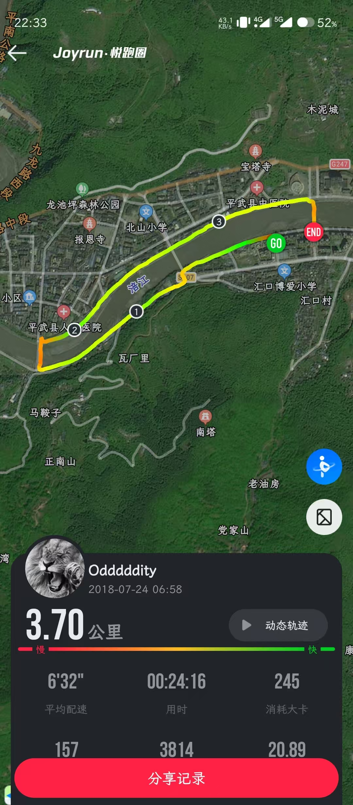
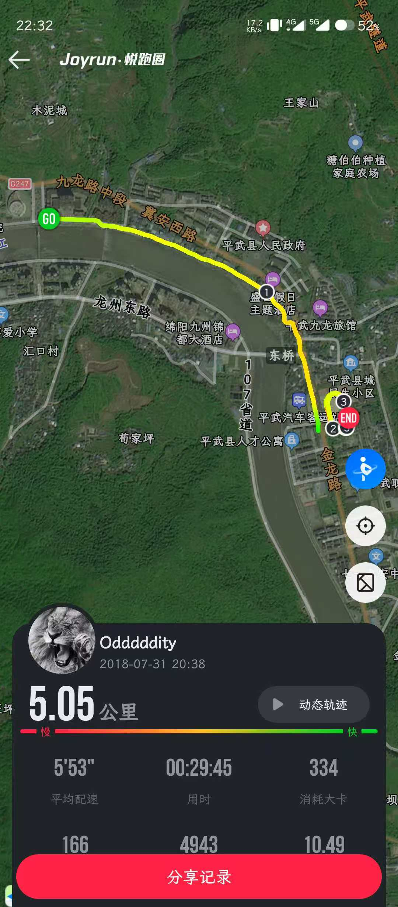

+++
title = '关于 Passionfruit'
date = 2026-02-04T13:03:13+08:00
draft = false
description = ''
slug = 'passionfruit'
tags = ['回忆', '碎碎念', '随笔']
categories = ['出神']
license = false
+++

18年高二升高三暑假前，语文老师产假，另一位语文老师来代课，姓蒋，是当时的副校长。课程内容还是正常的讲授，但放假前他给我们布置了一个不一样的暑假作业：跑步，男生需累计跑 50km。

而如同往常一样，暑假我大多会在平武县城待一段时间，再回雅安。

有时是清晨，沿着河堤，听着河水，看雾气从远处山林中蒸腾。

有时是晚上，没什么能打发跑步的无聊，就只能靠音乐。

有时跑到着县城的中学，已经放假没什么人，和保安打声招呼，说明原有，也不会为难。

于是我能在操场绕圈。

想起第一次去那个操场，还是我中考的时候。县城就一个中考考点，便设在这里。考试前一天和镇上初中的小伙伴们看完考场后，便在这里瘫坐成一排，也不记得当时说了些什么，不过肯定不是在说考试。

Passionfruit 就是那时候跑步开始听的，后面就一直成了跑步经常会听的歌。

而那段跑步的氛围和感觉便存到了这首歌里：

具体路上的景色，跑步时的疲惫，都记不清，只剩下一种模糊的感觉

虽然是暑假，但是听这首歌时，一种淡淡的孤寂和清凉总会从耳朵蔓延到全身

