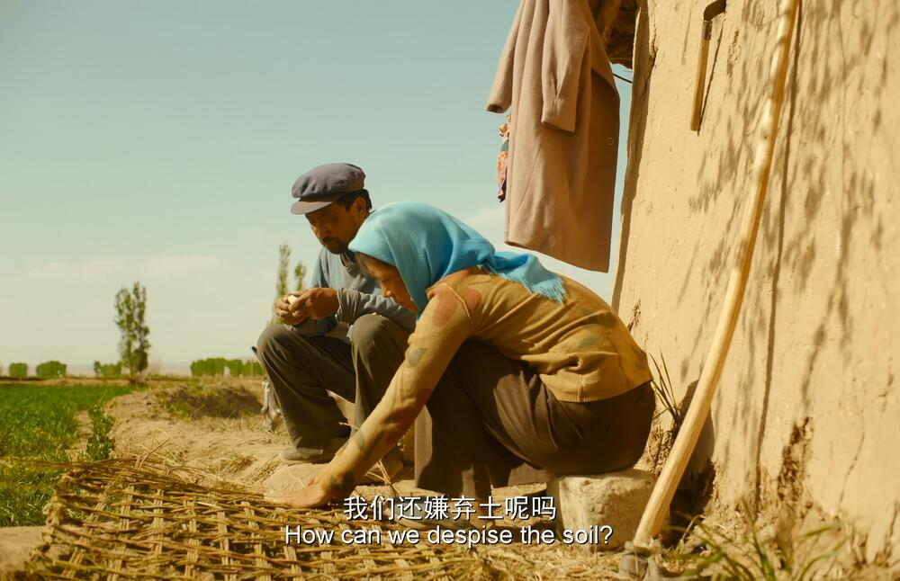

+++
title = '《隐入尘烟》观后感'
date = 2022-09-15T14:20:41+08:00
draft = false
description = '观看于22年秋，看完《隐入尘烟》后的一些想法'
slug = 'return-to-dust'
tags = ['电影']
categories = ['记录']
image = ''
license = false

+++

## 隐入尘烟
在电影院门前看到了这个电影的海报，觉得很有感觉，又看到海报上写着入围了第72届柏林国际电影节，觉得应该不错。于是便记住了这个电影。于是在养伤期间下载看了。

电影看下来是很喜欢的。在看电影之前我也看到有一些评论说，电影丑化了中国的农村。可是在我看来电影里的农村环境，生活环境都是很真实的。虽然自己的故乡不在西北，也没有真正的去过。但是电影里呈现出来农村的环境，人面对自然面对于土地面对生活的方式，会让我非常的熟悉。

整个电影看下来最打动我的两个点。一个是马有铁在面对生活中如此多的困苦时的那种乐观。这种乐观也可以说是在许许多多中国底层人民看到的，包括在自己家乡，在父辈身上看到的乐观。那种面对困苦时，并不会自怨自艾，会默默的寻找出属于自己的一条出路。就像在生活刚走上正轨，却因为村里要拆迁掉空闲的房子，当我还在担心来之不易的生活要遭受打击时，马有铁开始了一个人的建房。

第二个点是马有铁和曹贵英的爱情。困境下的爱情总是会让人更加容易感动。并且在粗犷的西北黄土地里，他俩的爱情却有着一种感人的细腻和含蓄。同时也带着一种和土地一样的质朴。

从我来自农村的经历来看，电影里让我觉得唯一让我觉得有点不太合理的是村里的关系，电影里几乎大部分的村民对马有铁夫妇的态度都是很冷漠的。尤其是河边那一堆闲谈的邻里。这样的关系在我经历过的农村，都是难以看到的。小时候从父母和周围邻居感受到的是，穷和苦难不会被人看不起，但是如果一个人不忠不孝还不知上进，这样的才会被看不起。更何况电影里马有铁虽然不富裕，但是上进，善良，而且很有自己的原则。而曹贵英也是同样的善良。而这样的人受到的确实邻里的冷漠，这一点是我觉得整个电影的质朴和真实之下不合理的地方。

看电影时，我总害怕这个电影会像活着一样，会充满着许多不可意料的意外和苦难，以至于我在观影的时候，总会在马有铁夫妇生活开始向好的时候担心会发生的意外。比如在他俩种植麦子的时候我总会担心天灾会让他们的麦子颗粒无收。比如多次的抽血会让马有铁倒下。但是慢慢看下来，发现并没有出现类似的情节。电影里对马有铁对土地的几次台词，都会触动我。在面临生活的苦难，尤其面对邻里甚至亲人的冷漠时，而土地不会骗人，这也是看到秋天让我很放心的一个点。“啥不是土里头生的，啥不是土里头长的，土都不嫌弃我们，我们还嫌弃土吗？土就是干净的东西嘛，不管你是有钱有势的人，还是啥人， 你只有种上一袋袋麦子，它就能给你长出十几袋子，二十几袋麦子来嚒。”

