+++
title = '午潮山初游'
date = 2024-01-26T21:20:28+08:00
draft = false
description = '记录第一次爬午潮山'
slug = 'wuchao'
tags = ['游山玩水']
categories = ['记录']
image = '呆坐3.jpg'
license = false

+++

# 初游午潮山

> 很好的路线，使我双腿颤抖，爱来自Oddyti

很早之前偶然间看到附近午潮山路线的照片，山顶的照片，登高望远感觉非常棒，所以很早就萌生了去爬午潮山的想法。

最近有些郁结，刚好所有期末报告都完成了，加上最近天朗气清，便择日不如撞日决定要独自去看看山顶的风景。

## 前期准备

除老和山北高峰的两次经历外，我并无其他徒步或登山经历。遂去小红书和两步路了解情况。一番了解，难度较大、野路较多是出现最多的两个描述。不过风景的确很好，乃玉泉周边难得的高山（高于北高峰）。念及我自幼长于山野，曾经和村里小伙伴上山下河，偷菜野炊，区区野路，有何惧！（实际上还是有点担心的，但是登高望远的诱惑确实很大，也能排解郁结，所以还是去了）。

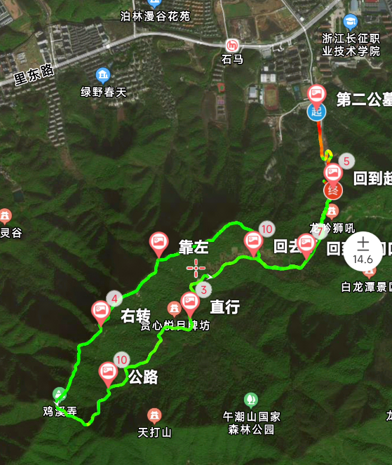

权衡利弊下，选择了午潮山山脊环线路线，见上图。为何名之山脊环线，只因（警觉！）大部分路程都在山脊上（卫星图中可看出）。两步路已有好心人记录轨迹并附带详细的指引，其路程约7.5公理，爬升约400米，并下载好了离线轨迹以防无信号。

行李：小包纸+湿巾X1，脆香米X1（超人？忍者神龟？），三粒装费列罗X1（纯属借着爬山机会解馋），上次买的水果还剩的梨X1（梨是伏笔），怡宝纯净水X1（个人钟爱怡宝），桃李面包X1，充电宝和充电线，塑料袋X1（装垃圾），日记本，钢笔。

出发准备：于四食堂食不要汤鸡块拌面；于石马地铁站清空肠道（减重，很重要）

## 正途

北门乘3号线地铁至石马C口，抬头见一高山，见下图最高山，实际看起来比图中还要高，自古便道“望山跑死马”，故叹曰：艹（语气词，无实意），这山怎么这么高，别告诉我今天要爬的山就是它吧（究竟是不是呢，买个关子先）？心中忐忑，却略有期待。

步行至杭州市第二公墓，便来到了两步路路线起始点。看见了很多只狗狗（哇狗狗！），要是能有一只能陪着我上山就好了（妄想ing），忘记拍照了，不过返程时候拍了（见后文）

匆匆告别短短的一段公路之后，便拐入了野路（怎么一来就上难度的），这一段野路爬升确实很快，因为不一会之后就开始气喘吁吁了。

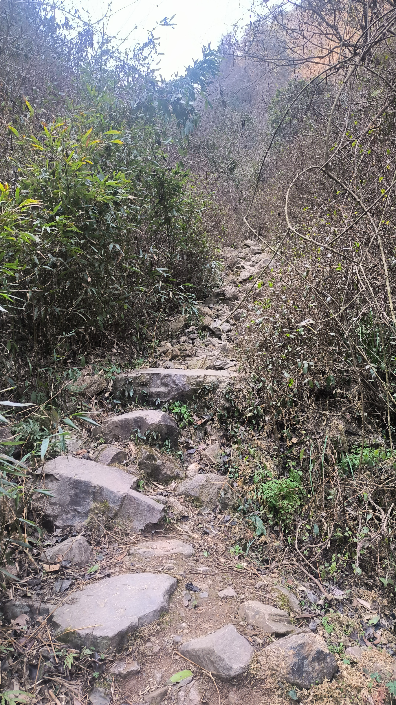

终于结束野路后，来到了午潮山惨案遗址（勿忘国耻）。

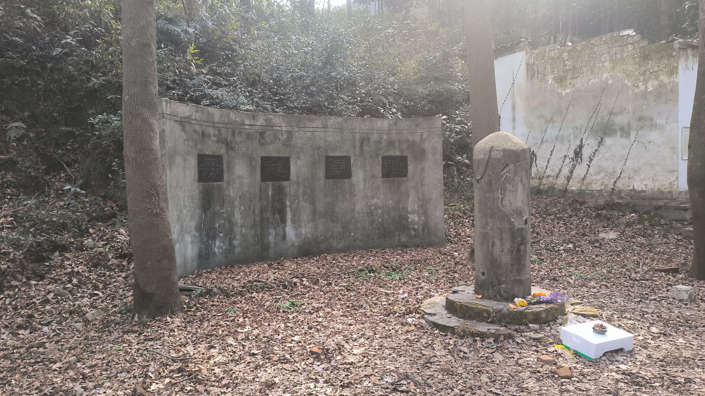

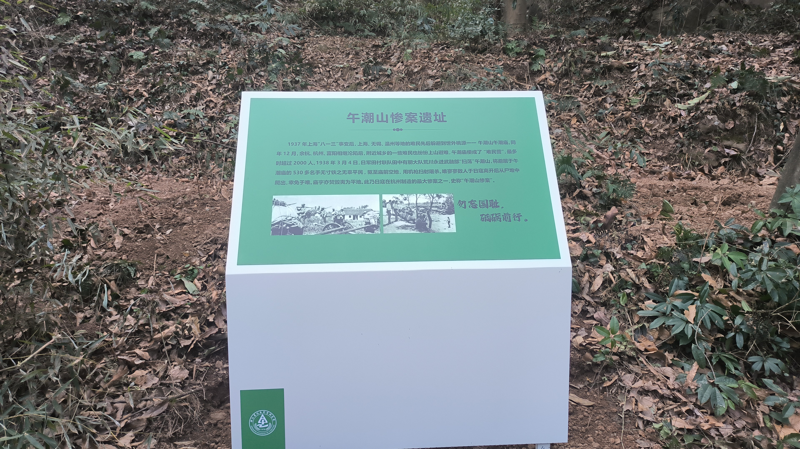

然后便迎来了短短的不舍的一段马路和铺装路，来到了午潮山森林公园入口。

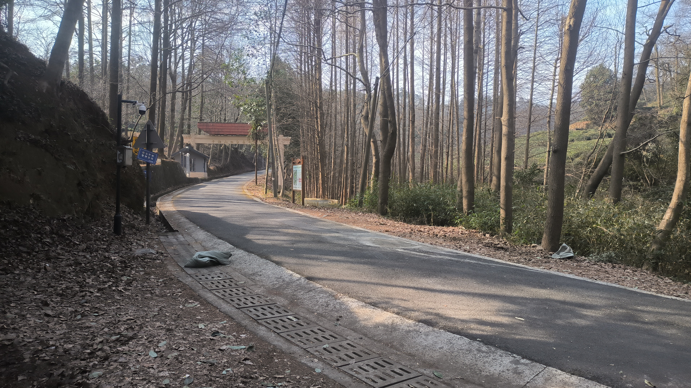

好景不长，爬升一段之后，终于来到了正式登山的野路，但是此时已累的不行，亦开始后悔着羽绒服爬山。休整一段只好将羽绒服脱下装入背包。掏出洗好的梨（回收伏笔），精力瞬间MAX（啊真甜！）。

继续出发，穿林过石，海拔也来到了312米。

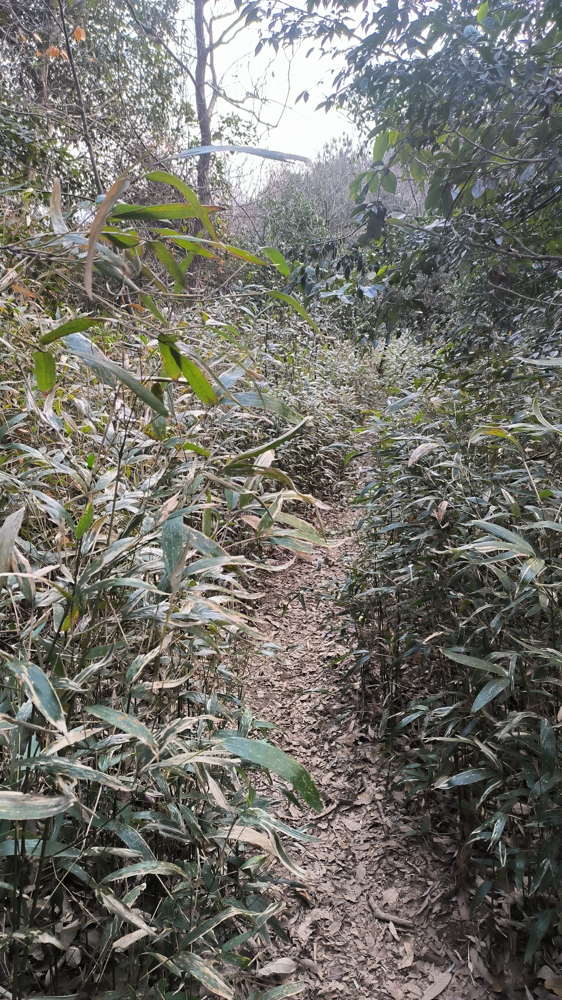

终于正式来到了山脊环线的山脊处，也是第一个可以眺望的点。箭头处便是最开始感叹“望山跑死马”的地点，从这里再回望很是开心。

沿山脊行，右为城市机器轰鸣，左为山野寂静鸟语，很是奇妙。

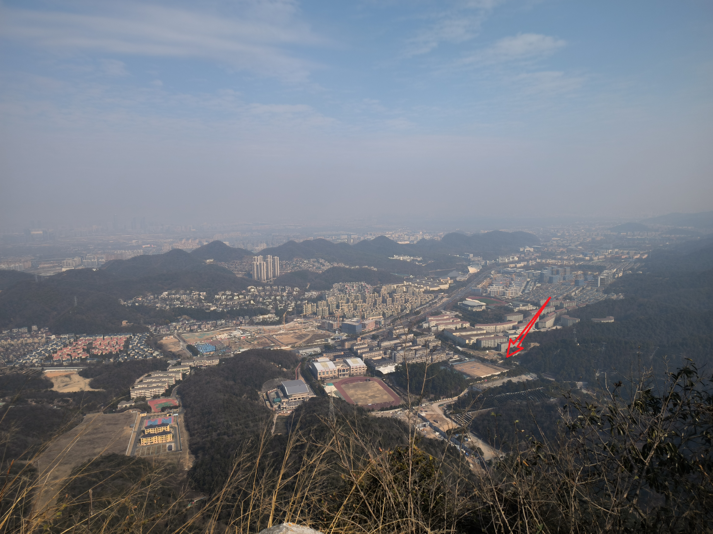

从此开始，便开始了整个山脊线最险峻也是风景最美丽也是最难爬的一段路，一路不断地艰难登顶，休整后又沿山脊下坡，再登顶，如此走完了整个北环线，大大小小登顶五六处。期间几为野路，不乏乱石嶙峋陡峭之处，需要手脚并用攀爬。如此多的登顶下山，期间我也知道了最开始的答案。

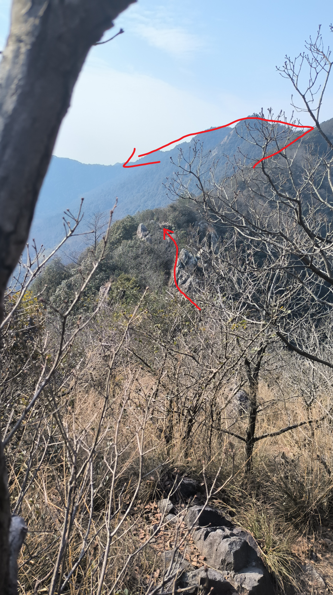

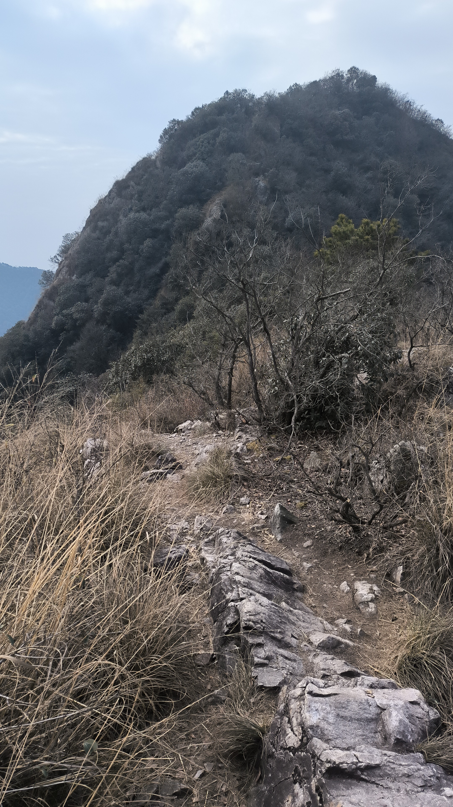

在此（下图）呆坐几分钟，看层峦叠嶂，听鸟鸣。打开日记，记下前段的旅途见闻。并享用两颗美味的费列罗！剩一颗留着激励自己最后爬不动时候的奖励（萝卜与驴）。

下图是此行到达的山顶中最美丽的山顶，从树林中穿出，豁然开朗！也是此行中最不想离开的地方。在此坐了十几分钟，补充体力。

下山时，手脚并用的一处。

西湖区和富阳的界碑（原来已经快出西湖区来到富阳了），在西湖和富阳之间反复横跳（诶我在西湖区，诶我又到富阳了，诶我又回西湖区了）。

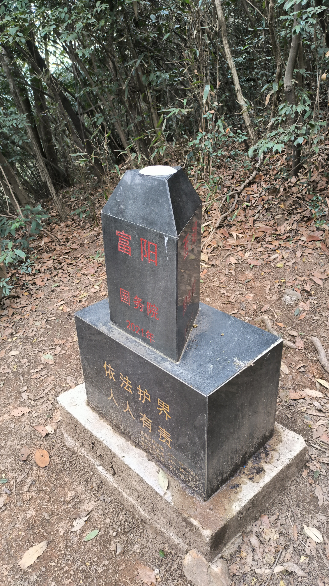

期间路上被一声很大声的布谷吓了一跳，之后还旁听了一场鸟儿们的辩论（正方说得对！）

之后就是真正下山路，真正明白什么是上山容易下山难（但是下山确实没有上山累），很长一段充满落叶、陡林中土路。每一步都需要小心翼翼，侧着落脚，以防滑倒。

终于回到了公路，这一段公路即是山脊环线的南环线部分，北环线在山脊穿行，而南环线便是美丽一段蜿蜒在山腰的公路。

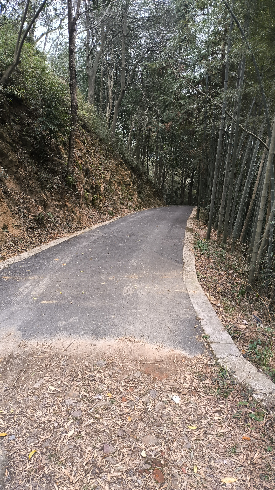

不知那位伤心小朋友的草莓熊最后落在这里了

深山里竟然也有麦麦（麦门永存！）

公路结束之后，便回到了午潮山森林公园大门。再次经过午潮山惨案遗址，总觉得该做点什么，便把脆香米放在了贡品的位置。

最后一段野路，隔篁竹，闻水声。

回到了第二公墓，遇见了狗狗们。这次拍照了。

再次回望山顶，你已经被我征服啦！

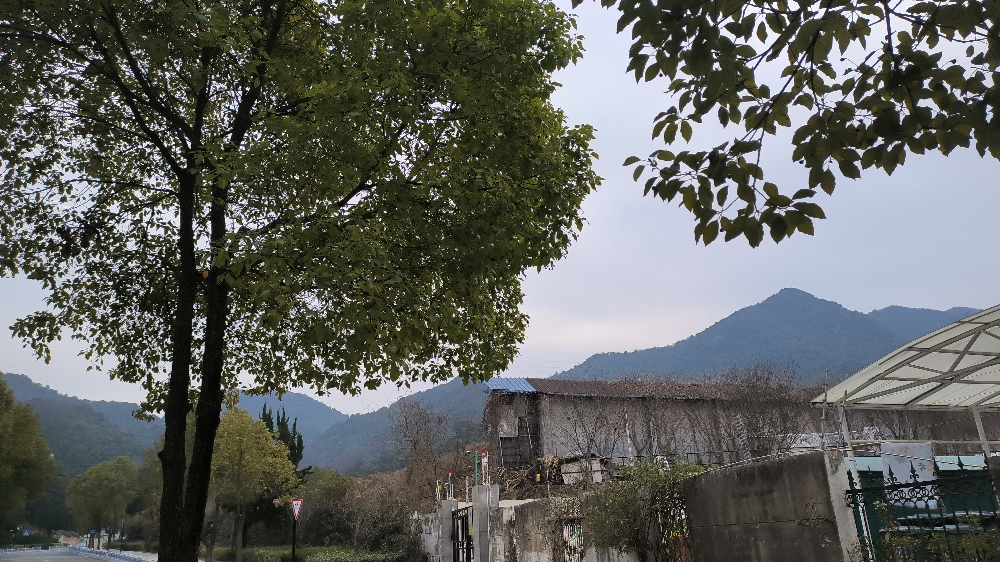

## 总结

9点40左右达到石马地铁站出发，14点左右回到石马地铁站。总用时3小时左右。很好的路线，使我双腿颤抖，爱来自Oddyti

还是比较推荐的一个路线，有些难度，推荐结伴而行。

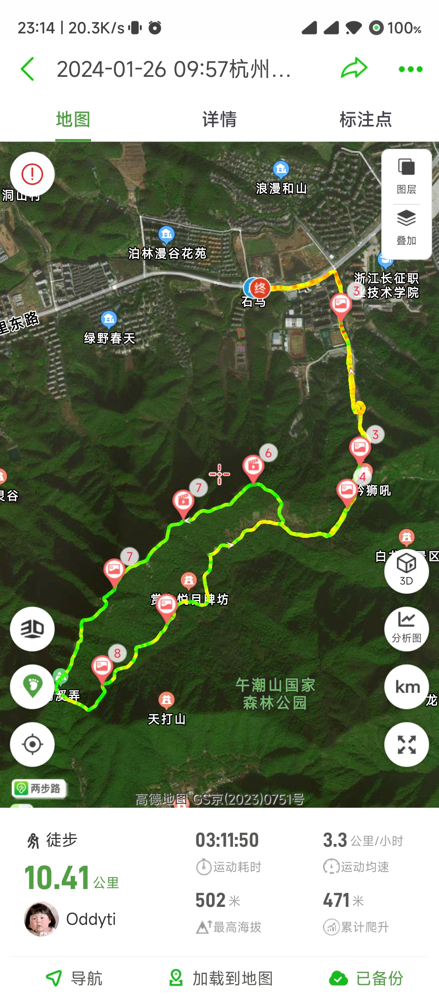
